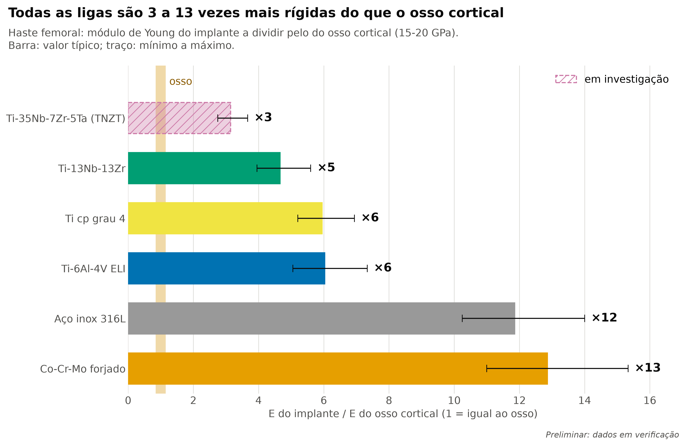
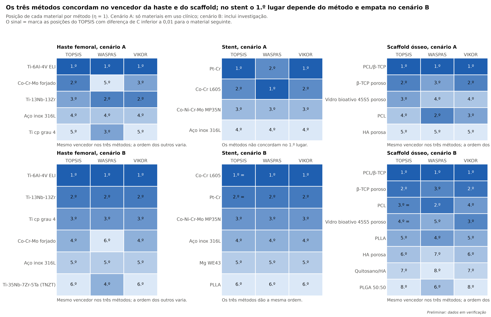
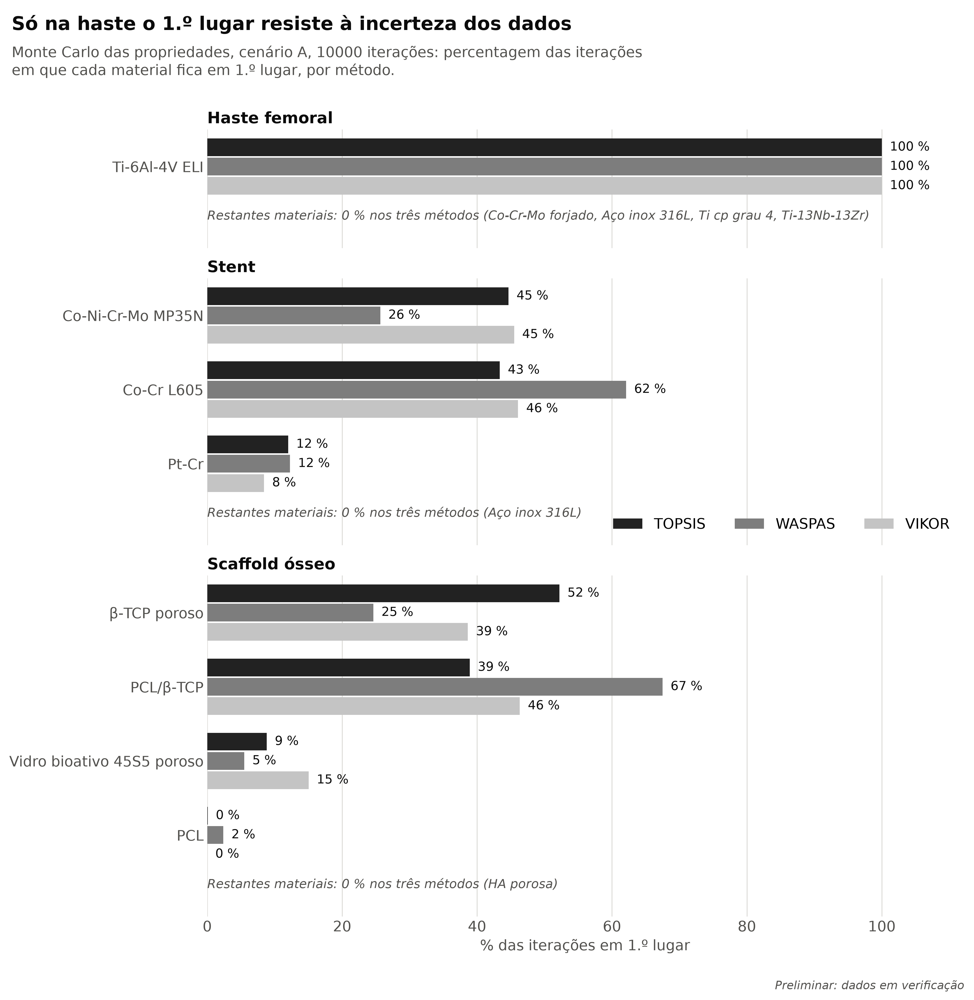
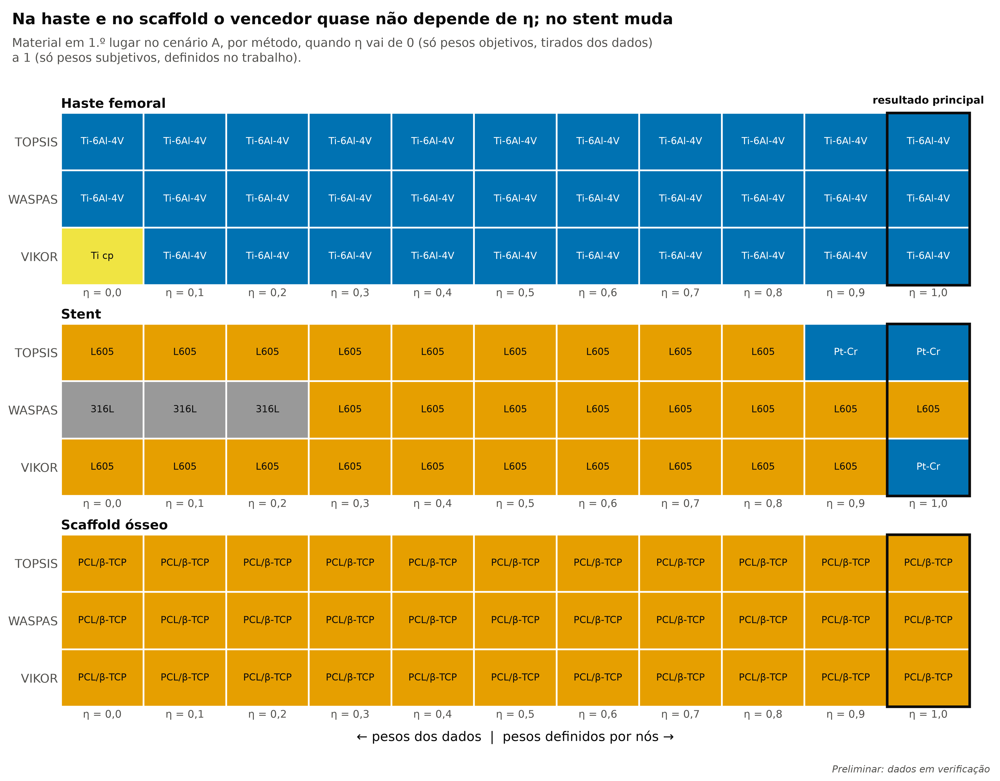
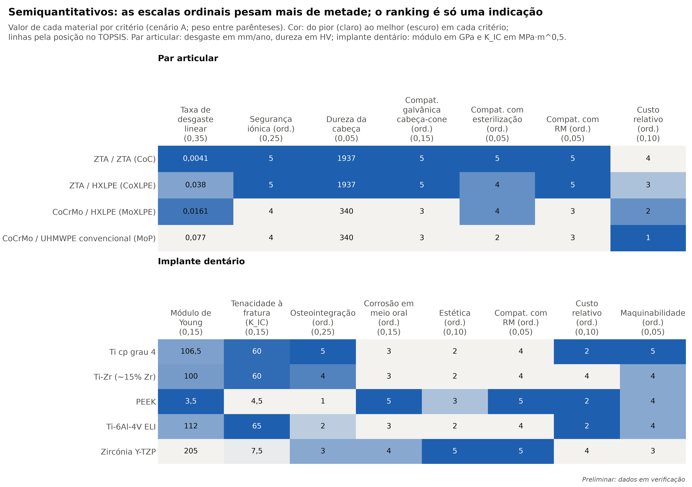
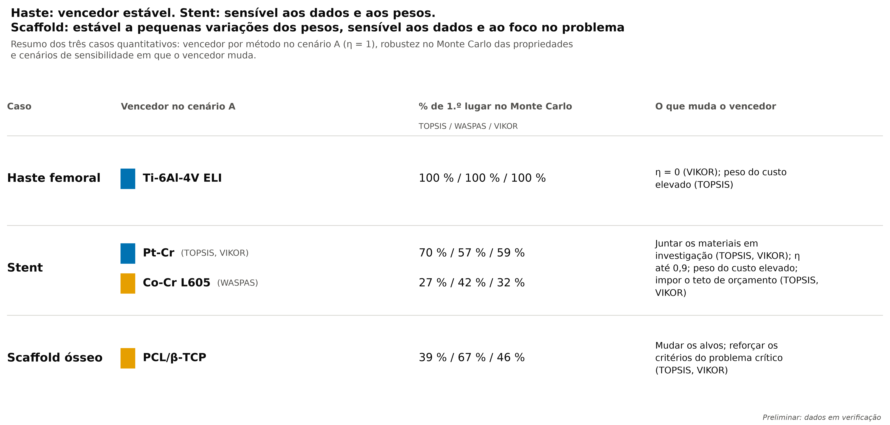

# 1. Introdução

A escolha do material de um dispositivo implantável é sempre um compromisso. Uma liga pode ter excelente resistência à fadiga e ser rígida demais para o osso; um cerâmico pode ser muito bioativo e frágil; um polímero pode degradar-se ao ritmo certo e não ter resistência suficiente. Não existe um "biomaterial ideal" absoluto: existe o material que melhor equilibra os requisitos de uma aplicação concreta, com as prioridades de quem decide.

A seleção de materiais em engenharia faz-se tradicionalmente com mapas de propriedades e índices de mérito, que comparam materiais em duas ou três propriedades de cada vez (Ashby [1]). Quando há muitos critérios de natureza diferente (mecânicos, biológicos, clínicos e económicos) e é preciso ponderá-los, recorre-se a métodos de decisão multicritério, que têm sido aplicados à seleção de materiais e de biomateriais (Jahan et al. [2]). Uma limitação destes métodos é tratarem cada critério como 'quanto maior, melhor' ou 'quanto menor, melhor', o que não serve para propriedades em que o ideal é um valor intermédio, como a rigidez de um implante ósseo. As normalizações com critérios-alvo resolvem esta limitação (Jahan et al. [3]; Petković et al. [4]).

Este trabalho responde à pergunta "qual é o biomaterial ideal?" para cinco componentes:
- a haste femoral e o par articular de uma prótese total da anca;
- um stent coronário expansível por balão;
- um scaffold para regeneração óssea;
- um implante dentário.

Para tornar o compromisso explícito e reprodutível, usou-se a decisão multicritério (MCDM). Os materiais candidatos foram comparados em vários critérios ao mesmo tempo, com pesos justificados, por três métodos diferentes (TOPSIS, WASPAS e VIKOR). Seguiu-se a abordagem de critérios-alvo de Petković et al. [4], em que o melhor valor de uma propriedade nem sempre é o maior ou o menor. Por exemplo, o módulo de Young de uma haste deve aproximar-se do osso.

O trabalho tem quatro contribuições:
1. a aplicação de MCDM com critérios-alvo a três dispositivos diferentes, com os mesmos métodos e as mesmas regras;
2. uma base de dados em que cada valor tem fonte rastreável e estado de verificação, com regras explícitas para comparar valores de fontes diferentes (forma do produto e porosidade);
3. uma análise de robustez que distingue os resultados sólidos dos frágeis;
4. a validação da implementação contra o estudo publicado, que revelou uma incoerência nos dados desse artigo.

O relatório está organizado da seguinte forma:
- a secção 2 descreve os métodos;
- a secção 3, a validação;
- as secções 4 a 7, os casos clínicos, cada um com a resposta às questões do enunciado;
- a secção 8 discute os resultados e as limitações;
- a secção 9 apresenta as conclusões.

A Tabela 1 resume, para cada caso, o problema do material atual, os biomateriais comparados e a proposta.

**Tabela 1.** Resumo dos casos.

| Caso | Problema | Biomateriais a investigar | Proposta |
|---|---|---|---|
| **Prótese da anca** | **Desgaste:** partículas do par articular que levam a osteólise e descolamento asséptico. **Corrosão/rejeição:** iões Co/Cr nos pares metal-metal e corrosão na junção cabeça-cone. **Mecânico:** stress shielding por rigidez excessiva da haste. | *Haste:* aço inox 316L, Co-Cr-Mo forjado, Ti-6Al-4V ELI, Ti cp grau 4, Ti-13Nb-13Zr; Ti-35Nb-7Zr-5Ta (TNZT, em investigação, só no cenário B). *Par articular:* CoCrMo/UHMWPE, CoCrMo/HXLPE, ZTA/HXLPE, ZTA/ZTA, CoCrMo/CoCrMo (metal-metal, eliminado na triagem). | Haste em Ti-6Al-4V ELI. Par articular: cerâmica-cerâmica (ZTA/ZTA) como referência para o problema do desgaste e da libertação de partículas; cabeça de ZTA contra polietileno altamente reticulado como alternativa com menor risco de fratura e de ruído. |
| **Implante dentário** | **Rejeição/integração:** falha de osteointegração e peri-implantite. **Mecânico:** fratura do implante ou do pilar. Estética em gengiva fina. | Ti cp grau 4, Ti-6Al-4V ELI, Ti-Zr (cerca de 15 % Zr), zircónia Y-TZP, PEEK. | Titânio comercialmente puro de grau 4 com superfície rugosa como referência; Ti-Zr como alternativa em implantes de diâmetro reduzido; zircónia Y-TZP como alternativa estética, sem eliminar o risco de peri-implantite, que depende também do controlo de placa e de fatores do doente. |
| **Stent vascular** | **Rejeição/resposta do organismo:** reestenose por hiperplasia da neoíntima e trombose tardia. **Corrosão:** libertação de níquel em doentes com alergia. **Mecânico:** recuo elástico e struts espessos. | Aço inox 316L, Co-Cr L605, Co-Ni-Cr-Mo MP35N, Pt-Cr; bioabsorvíveis (liga de Mg WE43, PLLA) só no cenário B. Nitinol fica fora da comparação por ser autoexpansível. | Platina-crómio (Pt-Cr) com struts finos e eluição de fármaco como referência; cobalto-crómio L605 como alternativa praticamente equivalente, e a escolha com orçamento limitado. Os bioabsorvíveis são discutidos a partir do caso Absorb. |
| **Scaffold ósseo** | **Mecânico:** compromisso entre porosidade e resistência. **Degradação:** reabsorção dessincronizada da formação de osso novo e acidez dos produtos de degradação dos poliésteres. | PCL, PLLA, PLGA 50:50, hidroxiapatite (HA) porosa, β-TCP poroso, vidro bioativo 45S5, compósito PCL/β-TCP, quitosano/HA. | Compósito PCL/β-TCP impresso em 3D quando o defeito exige suporte mecânico; β-TCP poroso quando a prioridade é só o suporte celular e a reabsorção. |

# 2. Métodos

## 2.1 Visão geral

Para cada caso clínico seguiu-se o mesmo processo, em sete passos:
1. definição da função do dispositivo e do problema do material atual;
2. escolha dos materiais candidatos;
3. triagem por critérios eliminatórios;
4. definição dos critérios de comparação e dos respetivos pesos;
5. normalização dos valores e ordenação dos materiais por três métodos de decisão multicritério;
6. análise da robustez do resultado;
7. validação da implementação contra um estudo publicado.

Três casos (haste femoral, stent coronário expansível por balão e scaffold para regeneração óssea) foram tratados quantitativamente. Os outros dois componentes (par articular da anca e implante dentário) foram tratados de forma semiquantitativa, porque a maior parte do peso dos seus critérios cabia a escalas ordinais (60 % do peso nos dois; a regra do trabalho é não passar de 50 % nos casos quantitativos, que têm 30 a 45 %). Nestes, apresenta-se a matriz de dados e a triagem, sem ranking.

## 2.2 Materiais candidatos e cenários

Para cada caso, os candidatos incluem os materiais em uso clínico e alternativas em investigação. Para não misturar materiais com graus de evidência muito diferentes, os resultados foram obtidos em dois cenários:
- **Cenário A:** só materiais em uso clínico.
- **Cenário B:** inclui também materiais em investigação (e, no stent, os bioabsorvíveis).

## 2.3 Critérios

Cada critério pertence a um de quatro tipos:
- **Estrito (eliminatório):** o material passa ou não passa (por exemplo, a biocompatibilidade segundo a ISO 10993, ou o tipo de expansão do stent). Os materiais eliminados ficam registados, com o motivo.
- **Benefício:** quanto maior, melhor (por exemplo, o limite de fadiga).
- **Custo:** quanto menor, melhor (por exemplo, a densidade ou o custo relativo).
- **Alvo:** o melhor valor é um valor intermédio. É o caso do módulo de Young da haste, que deve aproximar-se do osso cortical para reduzir o stress shielding. Seguiu-se a abordagem de critérios-alvo de Petković et al. [4].

Usaram-se também dois índices derivados:
- σy/E, como indicador do recuo elástico do stent;
- E_implante/E_osso, como medida do desajuste de rigidez da haste.

Alguns critérios não têm uma grandeza física simples (resistência à corrosão, compatibilidade com ressonância magnética, fabricabilidade, custo relativo). Para estes usaram-se escalas ordinais de 1 a 5, com uma rubrica escrita para cada nível, apoiada em literatura.

## 2.4 Base de dados e verificação dos valores

Todos os valores estão numa base de dados única (ficheiros CSV). Cada valor tem um mínimo, um máximo, um valor típico, a fonte e um estado de verificação: "Verificado", "Verificado (fornecedor)", "Verificado (derivado)", "Verificado (composição química)" ou "A verificar".

Os valores de partida vieram de revisões. Os valores com mais influência no resultado foram verificados em fontes primárias (normas, artigos com ensaio, fichas técnicas de fabricantes e de fornecedores); os restantes ficam marcados "A verificar" (93 das 300 linhas da base estão verificadas). A ordem de verificação seguiu a influência de cada valor no resultado: cada valor foi variado ±20 % com os restantes fixos, e verificaram-se primeiro os que mudavam o vencedor.

Usaram-se três regras para manter os valores comparáveis:
- **Regra da forma:** quando uma propriedade depende da forma do produto (tubo, fita, fio, chapa), o mínimo e o máximo cobrem só a forma usada no dispositivo; os valores de outras formas ficam registados nas notas, mas não entram no cálculo. Quando a forma do dispositivo tem um único valor, aplica-se uma incerteza de ±10 %.
- **Regra da porosidade:** nos scaffolds, as propriedades mecânicas usam-se à porosidade típica do material (±10 pontos percentuais); o típico é a mediana das fontes dentro dessa janela.
- **Materiais permanentes num critério de reabsorção:** recebem o pior valor observado entre os reabsorvíveis do mesmo caso, como valor de modelação.

## 2.5 Normalização

Os critérios têm unidades diferentes (MPa, GPa, µm, escalas 1-5). Antes de os combinar, cada valor foi convertido numa nota adimensional entre 0 e 1. Nos critérios de benefício e de custo, a nota cresce com a proximidade ao melhor valor observado. Nos critérios-alvo, cresce com a proximidade ao valor-alvo, segundo a normalização de Petković et al. [4] (eq. 2 no TOPSIS; o WASPAS usa as eqs. 9 a 13 e o VIKOR uma distância ao valor de referência, eqs. 17 e 18).

## 2.6 Pesos

Os pesos combinam duas fontes de informação:
- **Pesos subjetivos (w^S):** definidos neste trabalho com base na função clínica de cada dispositivo, com a justificação de cada peso indicada na tabela de critérios.
- **Pesos objetivos (w^O):** obtidos dos próprios dados pelo método do desvio-padrão. Um critério em que os materiais diferem mais recebe mais peso, porque distingue melhor as alternativas.

Os dois combinam-se por w = η · w^S + (1 − η) · w^O. O resultado principal usa η = 1 (só pesos subjetivos, justificados clinicamente). A sensibilidade a η foi analisada de 0 a 1, em passos de 0,1.

## 2.7 Métodos de decisão multicritério

Usaram-se três métodos que combinam os critérios de formas diferentes. Quando concordam, o resultado é mais sólido:
- **TOPSIS:** ordena os materiais pela proximidade relativa a uma solução ideal (o melhor valor em todos os critérios) e pelo afastamento a uma solução anti-ideal. O resultado é o coeficiente C, entre 0 e 1. Um ponto forte pode compensar um ponto fraco.
- **WASPAS:** combina a soma ponderada e o produto ponderado das notas normalizadas (λ = 0,5). A parte multiplicativa penaliza fortemente um critério com nota muito baixa, por isso o método favorece materiais equilibrados.
- **VIKOR:** procura a solução de compromisso. Combina o afastamento total à solução ideal (S) com o maior afastamento num único critério (R), através de um parâmetro v = 0,5. O índice final (P, na notação de Petković et al.) é tanto melhor quanto menor.

As equações de cada método seguem Petković et al. [4] e são apresentadas em anexo.

## 2.8 Análise de robustez

O resultado foi testado em várias frentes:
- **Cenários de sensibilidade:** retirar os critérios ordinais (Q); variar η de 0 a 1; alterar os valores-alvo (T); dar peso baixo ou elevado ao custo (C-custo); excluir na triagem os materiais com custo relativo acima de 3, sem mudar os pesos (teto de orçamento, O-orçamento); duplicar o peso dos critérios ligados ao problema crítico indicado pelo docente para cada dispositivo, com os restantes renormalizados (P-foco); no stent, variar o valor atribuído aos permanentes no tempo de reabsorção (R-sentinela).
- **Monte Carlo das propriedades:** 10 000 repetições (semente 42), com cada valor sorteado uniformemente entre o mínimo e o máximo da base. Os valores de uma única fonte, sem intervalo, variaram ±10 % à volta do típico.
- **Monte Carlo dos pesos:** pesos perturbados ±20 %.
- **Concordância entre métodos:** coeficiente de correlação de Spearman entre as ordenações.
- **Consenso entre métodos:** calculou-se também um ranking de consenso pela contagem de Borda. Cada método atribui a cada material (m − posição) pontos, sendo m o número de materiais, e os materiais ordenam-se pela soma; em caso de empate, prevalece a posição no TOPSIS. O consenso apresenta-se ao lado dos três métodos e não os substitui, porque a discordância entre eles é, ela própria, informação sobre a robustez do resultado.
- **Regra de empate:** duas posições consecutivas cujo C do TOPSIS difere menos de 0,01 consideram-se empatadas.

## 2.9 Validação da implementação

A implementação foi validada reproduzindo o caso de estudo da prótese da anca de Petković et al. [4]. Foram reproduzidos os 15 coeficientes C publicados e as posições correspondentes, com uma diferença máxima de cerca de 5 × 10⁻⁶.

Nesta reprodução detetou-se uma incoerência no artigo: o valor de M1-C9 na Tabela A3 é 0,41, mas os resultados publicados só se reproduzem com 0,59. Os dados foram mantidos fiéis à tabela e a diferença ficou documentada (secção de validação).

## 2.10 Implementação e reprodutibilidade

Todo o processo foi implementado em Python, com testes automáticos para cada função (192 testes, dos quais 8 são falhas esperadas que documentam a incoerência do artigo reproduzido). Os dados, o código e os resultados estão num repositório com histórico de versões, e os resultados podem ser regenerados por quatro scripts (cálculo dos cenários, lista dos valores por verificar, figuras e folha de cálculo).

# 3. Validação da implementação

Antes de aplicar os métodos aos casos deste trabalho, foi necessário garantir que a implementação estava correta. Para isso reproduziu-se um estudo publicado que usa os mesmos métodos com critérios-alvo: Petković et al. [4], Applied Sciences 15(16):9198.

## 3.1 Reprodução do caso da prótese da anca

Reproduziu-se o caso de estudo 2 do artigo (seleção de material para prótese da anca), com a matriz de decisão, os tipos de critério, os valores-alvo e os pesos publicados. A implementação reproduziu:
- os 15 coeficientes C do TOPSIS publicados (um por material, com η = 1, Tabela 3), com uma diferença máxima de cerca de 5 × 10⁻⁶;
- as posições correspondentes;
- os 15 valores Q do WASPAS e os 15 valores P do VIKOR dos casos 1 e 2 do artigo (Tabelas 1 e 3), com uma diferença inferior a 10⁻⁵, e as 60 posições da Tabela 4 em cada método.

Um único resultado, para η = 0,7, difere por efeito de arredondamento dos valores publicados, e está registado como diferença esperada.

## 3.2 Incoerência encontrada no artigo

Na reprodução detetou-se uma incoerência nos dados publicados. Na Tabela A3, o material M1 tem o valor 0,41 no critério C9. Com esse valor, os resultados calculados não coincidem com os publicados; com 0,59, coincidem todos.

A tabela foi verificada célula a célula sobre a imagem das páginas do artigo, e o valor impresso é de facto 0,41. A Figura A6 do próprio artigo, uma captura do software dos autores, mostra 0,59 nessa célula. Conclui-se que o software usou 0,59, e que a incoerência está na tabela publicada e não na implementação.

Os dados foram mantidos fiéis à tabela publicada, e a diferença ficou documentada com um teste separado que usa 0,59. Este resultado mostra o valor de reproduzir estudos publicados antes de reutilizar os seus métodos, e é uma contribuição deste trabalho para a reprodutibilidade em decisão multicritério.

# 4. Prótese total da anca

## 4.1 Problema crítico e resposta

**Problema indicado pelo docente: desgaste e libertação de partículas.**

O problema concentra-se nas superfícies que deslizam (o par articular) e na junção modular entre a cabeça e a haste. Na análise, os critérios que lhe respondem diretamente são a taxa de desgaste (peso 0,35), a segurança iónica (0,25, também critério eliminatório, que exclui o par metal-metal) e a compatibilidade galvânica entre a cabeça e o cone (0,15).

O par cerâmica-cerâmica (ZTA/ZTA) ficou em 1.º lugar com os três métodos, e manteve-se em 1.º quando o peso dos critérios ligados ao problema foi duplicado. É a resposta proposta, com a cabeça de ZTA contra polietileno altamente reticulado como alternativa. Na haste, o Ti-6Al-4V ELI mantém-se em 1.º também com este foco, e a escolha de uma cabeça cerâmica elimina a libertação de Co e Cr por corrosão por fretting na junção.

## 4.2 Candidatos e critérios

### Haste femoral

Os critérios e os pesos estão na Tabela 2.

**Tabela 2.** Critérios, tipo, alvo, peso e justificação: haste femoral.

| Critério | Tipo | Alvo | Peso | Justificação |
|---|---|---|---|---|
| Biocompatibilidade (ISO 10993) | eliminatório | Aprovado |  | Triagem: elimina não biocompatíveis |
| Módulo de Young | alvo | 17 GPa | 0,20 | Aproximar do osso cortical → reduzir stress shielding |
| Limite de fadiga (10^7 ciclos) | benefício |  | 0,25 | ~1,9 milhões de ciclos de marcha/ano (Silva et al. [5]) |
| Tensão de cedência | benefício |  | 0,10 | Evitar deformação plástica |
| Resistência à corrosão (ordinal 1-5) | benefício |  | 0,15 | Libertação iónica |
| Densidade | custo |  | 0,05 | Critério secundário |
| Compatibilidade com RM (ordinal 1-5) | benefício |  | 0,10 | Doentes idosos precisam frequentemente de RM |
| Custo relativo de material e fabrico (1-5, 5 = mais caro) | custo |  | 0,05 | Perspetiva do hospital (enunciado) |
| Fabricabilidade (ordinal 1-5) | benefício |  | 0,10 | Inclui fabrico aditivo de hastes porosas |

### Par articular (semiquantitativo)

Os critérios e os pesos estão na Tabela 3.

**Tabela 3.** Critérios, tipo, alvo, peso e justificação: par articular (semiquantitativo).

| Critério | Tipo | Alvo | Peso | Justificação |
|---|---|---|---|---|
| Segurança iónica / risco ALTR (ordinal 1-5) | eliminatório | ≥ 2 |  | Triagem: elimina o MoM (segurança não é compensável) |
| Risco de fratura da cabeça cerâmica | eliminatório | Avaliação qualitativa |  | K_IC retirado da matriz; discutido no texto |
| Taxa de desgaste linear | custo |  | 0,35 | SEMIQUANTITATIVO (ordinais > 50 %). Partículas → osteólise |
| Segurança iónica / risco ALTR (ordinal 1-5) | benefício |  | 0,25 | Lição do MoM |
| Dureza da cabeça | benefício |  | 0,05 | Riscos por terceiro corpo |
| Compatibilidade galvânica cabeça-cone (ordinal 1-5) | benefício |  | 0,15 | Corrosão na junção (trunnionosis) |
| Compatibilidade com esterilização (ordinal 1-5) | benefício |  | 0,05 | Oxidação do PE irradiado |
| Compatibilidade com RM (ordinal 1-5) | benefício |  | 0,05 |  |
| Custo relativo de material e fabrico (1-5, 5 = mais caro) | custo |  | 0,10 |  |

## 4.3 Resultados

### Haste femoral

Os resultados estão na Tabela 4.

**Tabela 4.** Pontuação e posição nos três métodos e consenso de Borda, cenários A e B: haste femoral.

| Cenário | Material | C (TOPSIS) | Pos. T | Q (WASPAS) | Pos. W | P (VIKOR) | Pos. V | Consenso (Borda) |
|---|---|---|---|---|---|---|---|---|
| A | Ti-6Al-4V ELI | 0,752 | 1 | 0,836 | 1 | 0,000 | 1 | 1 (12 pts) |
| A | Co-Cr-Mo forjado | 0,577 | 2 | 0,575 | 5 | 0,725 | 3 | 3 (5 pts) |
| A | Ti-13Nb-13Zr | 0,532 | 3 | 0,767 | 2 | 0,606 | 2 | 2 (8 pts) |
| A | Aço inox 316L | 0,467 | 4 | 0,602 | 4 | 0,767 | 4 | 4 (3 pts) |
| A | Ti cp grau 4 | 0,453 | 5 | 0,739 | 3 | 0,853 | 5 | 5 (2 pts) |
| B | Ti-6Al-4V ELI | 0,807 | 1 | 0,836 | 1 | 0,000 | 1 | 1 (15 pts) |
| B | Ti-13Nb-13Zr | 0,667 | 2 | 0,767 | 2 | 0,318 | 2 | 2 (12 pts) |
| B | Ti cp grau 4 | 0,587 | 3 | 0,739 | 3 | 0,522 | 3 | 3 (9 pts) |
| B | Co-Cr-Mo forjado | 0,573 | 4 | 0,575 | 6 | 0,756 | 4 | 4 (4 pts) |
| B | Aço inox 316L | 0,496 | 5 | 0,602 | 5 | 0,785 | 5 | 5 (3 pts) |
| B | Ti-35Nb-7Zr-5Ta (TNZT) | 0,457 | 6 | 0,619 | 4 | 0,963 | 6 | 6 (2 pts) |

Diferença de C entre o 1.º e o 2.º no TOPSIS: cenário A: ΔC = 0,175; cenário B: ΔC = 0,140.

### Par articular (semiquantitativo)

Os resultados estão na Tabela 5.

**Tabela 5.** Pontuação e posição nos três métodos e consenso de Borda, cenários A e B: par articular (semiquantitativo).

| Cenário | Material | C (TOPSIS) | Pos. T | Q (WASPAS) | Pos. W | P (VIKOR) | Pos. V | Consenso (Borda) |
|---|---|---|---|---|---|---|---|---|
| A | ZTA / ZTA (CoC) | 0,823 | 1 | 0,898 | 1 | 0,000 | 1 | 1 (9 pts) |
| A | ZTA / HXLPE (CoXLPE) | 0,669 | 2 | 0,509 | 2 | 0,340 | 2 | 2 (6 pts) |
| A | CoCrMo / HXLPE (MoXLPE) | 0,495 | 3 | 0,478 | 3 | 0,645 | 3 | 3 (3 pts) |
| A | CoCrMo / UHMWPE convencional (MoP) | 0,177 | 4 | 0,368 | 4 | 1,000 | 4 | 4 (0 pts) |
| B | ZTA / ZTA (CoC) | 0,823 | 1 | 0,898 | 1 | 0,000 | 1 | 1 (9 pts) |
| B | ZTA / HXLPE (CoXLPE) | 0,669 | 2 | 0,509 | 2 | 0,340 | 2 | 2 (6 pts) |
| B | CoCrMo / HXLPE (MoXLPE) | 0,495 | 3 | 0,478 | 3 | 0,645 | 3 | 3 (3 pts) |
| B | CoCrMo / UHMWPE convencional (MoP) | 0,177 | 4 | 0,368 | 4 | 1,000 | 4 | 4 (0 pts) |

Diferença de C entre o 1.º e o 2.º no TOPSIS: cenário A: ΔC = 0,154; cenário B: ΔC = 0,154.

SEMIQUANTITATIVO: escalas ordinais com mais de 50 % do peso; o ranking é uma indicação.

## 4.4 Robustez

### Haste femoral

- Monte Carlo das propriedades (10 000 iterações, cenário A), % de 1.º lugar (TOPSIS / WASPAS / VIKOR): Ti-6Al-4V ELI 99,99 % / 100,0 % / 100,0 %.
- Combinação com pesos objetivos (η de 0 a 1; η = 1 é o resultado principal), η em que o vencedor muda: TOPSIS: nunca; WASPAS: nunca; VIKOR: η = 0.
- P-foco (direta): TOPSIS Ti-6Al-4V ELI; WASPAS Ti-6Al-4V ELI; VIKOR Ti-6Al-4V ELI.
- P-foco (direta + indireta): TOPSIS Ti-6Al-4V ELI; WASPAS Ti-6Al-4V ELI; VIKOR Ti-6Al-4V ELI.

### Par articular (semiquantitativo)

- Caso SEMIQUANTITATIVO (escalas ordinais com mais de 50 % do peso): o ranking é uma indicação.
- P-foco (direta): TOPSIS ZTA / ZTA (CoC); WASPAS ZTA / ZTA (CoC); VIKOR ZTA / ZTA (CoC).
- P-foco (direta + indireta): TOPSIS ZTA / ZTA (CoC); WASPAS ZTA / ZTA (CoC); VIKOR ZTA / ZTA (CoC).

As Figuras 1, 2, 3, 4 e 5 mostram estes resultados.

{width=100%}

**Figura 1.** Razão entre o módulo de Young de cada liga candidata à haste e o do osso cortical (barra: valor típico; traço: mínimo a máximo).

{width=100%}

**Figura 2.** Posição de cada material por método (TOPSIS, WASPAS e VIKOR) nos três casos quantitativos, cenários A e B (η = 1).

{width=100%}

**Figura 3.** Monte Carlo das propriedades (10 000 iterações, cenário A): percentagem das iterações em que cada material fica em 1.º lugar, por método.

{width=100%}

**Figura 4.** Material em 1.º lugar no cenário A, por método, quando η vai de 0 (só pesos objetivos) a 1 (só pesos subjetivos).

{width=100%}

**Figura 5.** Valores por critério nos casos semiquantitativos (par articular e implante dentário), cenário A; cor do pior (claro) ao melhor (escuro) em cada critério.

## 4.5 Resposta às questões do enunciado

### Q1. Função do dispositivo

A prótese total da anca substitui a articulação coxofemoral quando esta está destruída por artrose, necrose avascular da cabeça do fémur ou fratura do colo do fémur. O objetivo é eliminar a dor e devolver ao doente uma mobilidade próxima da normal. O dispositivo tem dois subsistemas com exigências diferentes:
- A haste femoral, inserida no canal medular do fémur, transmite ao osso as cargas do corpo. Pode ser fixada com cimento ósseo (PMMA) ou sem cimento, por osseointegração.
- O par articular é formado pela cabeça femoral, montada na haste por um cone modular, e pelo componente acetabular (uma taça metálica com um inserto). É nele que ocorre o movimento de deslizamento da articulação.

Por isso, a seleção de material é feita em separado. Na haste o que conta é a resistência à fadiga e a compatibilidade de rigidez com o osso. No par articular o que conta é o desgaste e a produção de partículas.

### Q2. Propriedades mecânicas necessárias

Na marcha a cerca de 4 km/h, a força de contacto na anca é, em média, cerca de 2,4 vezes o peso corporal, e a subir e descer escadas cerca de 2,5 a 2,6 vezes (Bergmann et al. [6]). Em tropeções, as forças podem ser muito superiores (mais de 8 vezes o peso corporal; Bergmann et al. [7]). Um doente com prótese da anca faz, em média, cerca de 1,9 milhões de ciclos de marcha por ano (Silva et al. [5]), pelo que a haste tem de resistir a dezenas de milhões de ciclos ao longo da sua vida útil.

Para a haste, as propriedades determinantes são:
- Limite de fadiga elevado a 10^7 ciclos, porque a fratura por fadiga é a falha mecânica crítica.
- Tensão de cedência elevada, para evitar deformação plástica sob picos de carga.
- Módulo de Young o mais próximo possível do osso cortical. O trabalho usa um intervalo de 15-20 GPa; em fémur humano, os valores medidos vão de cerca de 13,6 a 17,6 GPa, consoante a idade e o tipo de ensaio (Li et al. [8], Tabelas 1 e 2). Um implante muito mais rígido do que o osso absorve a maior parte da carga e deixa o fémur proximal sem estímulo mecânico. É o fenómeno de stress shielding, que leva à reabsorção óssea. No trabalho, este critério foi tratado como critério-alvo (T = 17 GPa), seguindo a abordagem de Petković et al. [4].

Os valores de referência mostram o problema. O aço 316L (cerca de 205-210 GPa) e as ligas Co-Cr-Mo (cerca de 220-230 GPa; Navarro et al. [9]) são mais de dez vezes mais rígidos do que o osso. O Ti-6Al-4V ELI (101-110 GPa; Li et al. [8]) fica perto de metade. As ligas β de titânio, como o Ti-13Nb-13Zr (79-84 GPa) e o Ti-35Nb-7Zr-5Ta (cerca de 55 GPa, na variante com baixo teor de oxigénio; Li et al. [8]), aproximam-se mais.

No par articular, as propriedades determinantes são diferentes:
- Dureza elevada e baixa rugosidade superficial, para reduzir o desgaste.
- Tenacidade à fratura suficiente, sobretudo nas cabeças cerâmicas, em que a fratura é rara mas catastrófica.
- Baixo coeficiente de atrito.

### Q3. Propriedades químicas e físicas relevantes

- **Resistência à corrosão.** Os fluidos corporais contêm cloretos e são um meio agressivo. Os metais usados resistem porque formam um filme passivo de óxido: TiO2 nas ligas de titânio, Cr2O3 no aço e nas ligas Co-Cr. A estabilidade desse filme, e a sua capacidade de se refazer depois de ser riscado, determina a libertação de iões.
- **Densidade.** Tem uma relevância secundária no desempenho, mas as ligas de titânio (cerca de 4,4-4,5 g/cm³) são quase metade do aço e das ligas Co-Cr (cerca de 8 g/cm³).
- **Energia de superfície, rugosidade e molhabilidade.** Condicionam a adsorção de proteínas e a adesão de osteoblastos, e por isso a osseointegração nas hastes não cimentadas.
- **Comportamento magnético.** Os doentes com prótese da anca são geralmente idosos e fazem frequentemente ressonância magnética. Materiais não ferromagnéticos e de baixa suscetibilidade magnética (ligas de titânio) produzem menos artefactos de imagem do que as ligas Co-Cr e o aço: em hastes femorais num fantoma, a de titânio teve pontuações de artefacto 3 a 4 vezes mais baixas (Månsson et al. [10]).
- **No polietileno do inserto:** o grau de reticulação e a resistência à oxidação, que determinam o desgaste a longo prazo.

### Q4. Biocompatibilidade

A biocompatibilidade é um critério eliminatório: um material que não cumpra os ensaios da série ISO 10993 não é candidato. No trabalho foi tratada como critério estrito na fase de triagem. A avaliação foi qualitativa, com base no historial clínico e na normalização de cada liga para uso em implantes, porque não foram feitos ensaios ISO 10993 neste trabalho. Nenhum candidato foi eliminado.

Dentro dos materiais aprovados, há diferenças relevantes na natureza dos iões que podem libertar:
- O aço 316L contém níquel, um alergénio frequente.
- As ligas Co-Cr libertam iões de cobalto e crómio, associados a reações de hipersensibilidade e a efeitos sistémicos quando os níveis no sangue sobem.
- O Ti-6Al-4V contém alumínio e vanádio; o vanádio é citotóxico em forma iónica. Foi esta a motivação para desenvolver ligas β sem vanádio, como o Ti-13Nb-13Zr e o Ti-35Nb-7Zr-5Ta, com elementos considerados biocompatíveis (Nb, Zr, Ta).
- Na prática clínica, o Ti-6Al-4V tem décadas de bom desempenho em hastes, porque o filme de TiO2 mantém a libertação iónica muito baixa.

### Q5. Bioinerte, bioativo ou biodegradável

A haste deve ser **bioinerte e permanente**. Suporta carga durante toda a vida do doente, por isso um material biodegradável está excluído à partida.

Nas hastes não cimentadas, a superfície é tornada **bioativa** para promover a osseointegração. Consegue-se com um revestimento de hidroxiapatite projetado por plasma ou com uma camada porosa de titânio onde o osso cresce. O núcleo é bioinerte e a superfície é bioativa.

No par articular, a cerâmica (alumina ou compósito alumina-zircónia) e o polietileno são bioinertes. O objetivo é que libertem o mínimo possível de partículas.

### Q6. Riscos de corrosão, desgaste ou degradação

Os principais mecanismos de falha são:
- **Desgaste do par articular e osteólise.** O desgaste do polietileno produz partículas submicrométricas que desencadeiam uma resposta inflamatória crónica (questão 7). Essa resposta reabsorve o osso à volta do implante e acaba por causar o descolamento asséptico, a principal causa de revisão a longo prazo.
- **Corrosão por fretting na junção modular.** No cone entre a cabeça e a haste, micromovimentos repetidos rompem o filme passivo, e dentro da fenda o meio acidifica-se (corrosão em fresta). Com cabeças Co-Cr sobre hastes de titânio, este mecanismo liberta iões de cobalto e crómio mesmo sem par metal-metal (Goldberg et al. [11], em explantes; Cooper et al. [12]).
- **Pares metal-metal.** Produzem partículas e iões de Co e Cr em quantidade. Estão associados a reações adversas aos detritos metálicos (pseudotumores) (Chalmers et al. [13]), o que levou, por exemplo, à recolha do sistema DePuy ASR em 2010 (MHRA [14], MDA/2010/069).
- **Fratura por fadiga da haste.** É rara com as ligas atuais, mas possível em hastes subdimensionadas ou com defeitos de fabrico. É especialmente relevante em peças produzidas por fabrico aditivo sem pós-processamento (questão 9).
- **Fratura das cabeças cerâmicas.** É rara, mas grave quando ocorre. Num registo nacional, a fratura levou à revisão em cerca de 0,01 % das cabeças de ZTA, contra 0,15 % das de alumina (Hallan et al. [15]). O registo só conta fraturas que levaram a revisão.
- **Fratura ou lascagem do liner cerâmico**, incluindo durante a inserção na taça, e **ruído (squeaking)**, relatado em cerca de 3 % das ancas com cerâmicas de 4.ª geração (Zhao et al. [16]). São os riscos próprios do par cerâmica-cerâmica. No registo norueguês, a fratura do liner levou à revisão em cerca de 0,14 % das ancas cerâmica-cerâmica (Hallan et al. [15]).
- **Oxidação do polietileno reticulado.** A reticulação por radiação deixa radicais livres que, com o tempo, oxidam o material e o tornam frágil. Por isso se usa recozimento, refusão ou a adição de vitamina E como antioxidante.

### Q7. Resposta do organismo

Após a implantação, a superfície do material é coberta de proteínas em segundos. É essa camada, e não o material em si, que as células "veem". Segue-se uma resposta inflamatória aguda, própria de qualquer cirurgia.

Com uma superfície de titânio osseointegrável, os osteoblastos depositam osso diretamente sobre o implante, sem uma camada fibrosa intermédia. É a osseointegração, que garante fixação a longo prazo nas hastes não cimentadas. Com materiais menos favoráveis ou com micromovimento excessivo, forma-se uma cápsula fibrosa, e a fixação é mais fraca.

A longo prazo, a resposta mais importante é a resposta às partículas de desgaste. Os macrófagos fagocitam as partículas e libertam citocinas pró-inflamatórias (TNF-α, IL-1, IL-6), que estimulam a diferenciação de osteoclastos pela via RANKL. O resultado é a reabsorção do osso à volta do implante (osteólise).

Paralelamente, o stress shielding altera a distribuição de cargas no fémur. Como o osso se adapta às cargas que recebe (lei de Wolff), o fémur proximal perde densidade, o que compromete o suporte do implante e dificulta uma futura cirurgia de revisão.

### Q8. Vantagem face aos materiais atuais

Para a haste, propõe-se a **liga Ti-6Al-4V ELI** (ASTM F136). Na análise multicritério (TOPSIS, WASPAS e VIKOR, com critérios-alvo segundo Petković et al. [4]), ficou em 1.º lugar nos cenários A e B com os três métodos, depois da verificação das propriedades mecânicas nas fontes. O 2.º lugar depende do método: no cenário A, o TOPSIS coloca o Co-Cr-Mo forjado, enquanto o WASPAS e o VIKOR colocam o Ti-13Nb-13Zr.

Face ao aço 316L e às ligas Co-Cr-Mo, as vantagens são:
- módulo de Young cerca de metade, logo menos stress shielding;
- melhor resistência à corrosão e ausência de níquel e cobalto;
- menor densidade;
- menos artefactos em ressonância magnética;
- décadas de historial clínico em hastes.

A liga não é ideal. O módulo continua a ser cerca de seis vezes o do osso cortical, e o vanádio é uma limitação conhecida. As ligas β (Ti-13Nb-13Zr, Ti-35Nb-7Zr-5Ta) resolvem melhor ambos os problemas, mas têm menor historial clínico, maior custo e, no caso do Ti-35Nb-7Zr-5Ta, ainda não são usadas clinicamente. São a evolução natural desta escolha. Na análise de robustez, o 1.º lugar do Ti-6Al-4V ELI mantém-se em quase todas as variantes e só muda em dois casos. Com η = 0 na combinação de pesos (pesos só objetivos, pelo método do desvio-padrão), o VIKOR coloca o Ti cp grau 4 em 1.º. Com o custo com peso elevado (0,25), o TOPSIS coloca o aço 316L em 1.º. O segundo caso é relevante para o hospital: se o custo for o fator dominante, o aço encruado torna-se competitivo, à custa de uma rigidez muito maior e da presença de níquel. Em duas análises de Monte Carlo separadas (cenário A, 10 000 iterações cada), uma com variação aleatória das propriedades dentro dos intervalos da base e outra com variação dos pesos em ±20 %, o Ti-6Al-4V ELI ficou em 1.º lugar em pelo menos 99,99 % das iterações com os três métodos. O Ti-13Nb-13Zr nunca fica em 1.º lugar, e o Ti-35Nb-7Zr-5Ta, que só entra no cenário B, também não.

Para o par articular, a análise semiquantitativa coloca o par cerâmica-cerâmica (ZTA/ZTA) em 1.º lugar com os três métodos, e o resultado mantém-se quando se reforça o peso dos critérios ligados ao desgaste e à libertação de partículas. É a melhor resposta ao problema do desgaste: tem a taxa de desgaste mais baixa (cerca de 0,004 mm/ano; Higuchi et al. [17], valor de alumina, usado como pior caso) e não liberta iões metálicos. Tem, porém, dois riscos próprios: a fratura do liner cerâmico e o ruído (squeaking), relatado em cerca de 3 % das ancas com cerâmicas de 4.ª geração (Zhao et al. [16]).

Propõe-se por isso o **ZTA/ZTA** como escolha de referência para o problema do desgaste, sobretudo em doentes jovens e ativos, em que o desgaste acumulado ao longo de décadas pesa mais. Como alternativa, propõe-se uma **cabeça de ZTA contra polietileno altamente reticulado (HXLPE)**, com menor risco de fratura e de ruído e também sem iões metálicos no par. O polietileno altamente reticulado desgasta-se muito menos do que o convencional (cerca de 0,016 contra 0,077 mm/ano; Higuchi et al. [17], por radiografia; Teeter et al. [18], por radiostereometria), e a cabeça cerâmica elimina a libertação de Co e Cr na junção modular. As duas soluções evitam as reações adversas aos detritos metálicos; por isso o par metal-metal foi eliminado na triagem. A diferença de desgaste entre CoC e MoM (cerca de 0,004 e 0,005 mm/ano) está abaixo da resolução da radiografia simples.

### Q9. Fabrico

- **Haste em Ti-6Al-4V ELI:** fabrico convencional por forjamento a quente e maquinagem, seguido de tratamento de superfície. O fabrico aditivo (fusão em leito de pó por laser ou feixe de eletrões) permite hastes com zonas porosas de rigidez reduzida, mas exige prensagem isostática a quente (HIP) para eliminar porosidade interna. Em Ti-6Al-4V produzido por feixe de eletrões, a resistência à fadiga a 10^7 ciclos foi cerca de 200-250 MPa no estado de fabrico e 550-600 MPa após HIP (Hrabe et al. [19], NIST; ensaio de tração-tração com R = 0,1). Segundo os autores, o valor baixo no estado de fabrico deve-se em parte a defeitos do processo usado.
- **Superfície para fixação não cimentada:** jateamento abrasivo para criar rugosidade e revestimento de hidroxiapatite por projeção de plasma, ou camada porosa de titânio.
- **Cabeça cerâmica:** prensagem do pó, sinterização e HIP para máxima densidade, seguidas de retificação e polimento até rugosidade muito baixa.
- **Liner cerâmico:** o mesmo processo da cabeça (prensagem do pó, sinterização e prensagem isostática a quente, retificação e polimento até rugosidade muito baixa), com um encaixe cónico preciso na taça metálica acetabular.
- **Inserto de polietileno:** consolidação do pó por moldagem ou extrusão, reticulação por radiação gama ou feixe de eletrões, estabilização (vitamina E incorporada ou tratamento térmico), maquinagem final e esterilização.

### Q10. Testes antes da utilização clínica

- **Biocompatibilidade:** série ISO 10993 (citotoxicidade, sensibilização, irritação, toxicidade sistémica, genotoxicidade, implantação).
- **Fadiga da haste:** ISO 7206-4:2010 (haste) e ISO 7206-6:2013 (zona do colo).
- **Resistência da cabeça:** ISO 7206-10:2018 (carga estática em cabeças modulares).
- **Desgaste do par articular:** ensaio em simulador de anca segundo a ISO 14242-1:2014 (condições de ensaio) e a ISO 14242-2:2016 (medição).
- **Fixação do liner na taça:** forças de desmontagem do liner (push-out, pull-out e lever-out) segundo a ASTM F1820-22.
- **Corrosão:** polarização potenciodinâmica (ASTM F2129-25) e corrosão por fretting na junção modular (ASTM F1875-26).
- **Ressonância magnética:** ensaios de força, binário, aquecimento e artefactos (ASTM F2052-21, F2213-25, F2182-19e2, F2119-24).
- **Esterilização:** validação segundo ISO 11137 (radiação) ou ISO 11135 (óxido de etileno), consoante o componente.
- **Clínica:** ensaios pré-clínicos em animal e investigação clínica. Depois da colocação no mercado, seguimento em registos de artroplastia.

### Q11. Propriedades que caracterizam cada material face à aplicação

**Haste (Ti-6Al-4V ELI):**
- Ensaio de tração, para medir o módulo de Young, a tensão de cedência e a tensão de rotura.
- Ensaio de fadiga, para medir o limite a 10^7 ciclos.
- Dureza Vickers.
- Densidade.
- Microscopia ótica e eletrónica (SEM/EDS), para a microestrutura e a composição local.
- Difração de raios X (XRD), para identificar as fases α e β.
- XPS, para a composição do filme passivo.
- Ensaios eletroquímicos (polarização, EIS), para o comportamento à corrosão.
- Rugosidade (perfilometria ou AFM) e ângulo de contacto, para a superfície de osseointegração.

**Cabeça e liner cerâmicos:**
- Densidade.
- Dureza.
- Tenacidade à fratura.
- XRD, para as fases da zircónia (a transformação tetragonal-monoclínica condiciona o envelhecimento).
- Rugosidade da superfície articular.

**Inserto de polietileno:**
- Grau de reticulação.
- Índice de oxidação por FTIR (guia ASTM F2102-17(2026)).
- Cristalinidade por calorimetria diferencial (DSC).
- Propriedades de tração.
- Taxa de desgaste em simulador.

# 5. Stent vascular coronário

## 5.1 Problema crítico e resposta

**Problema indicado pelo docente: resistência mecânica e biocompatibilidade.**

A resistência mecânica corresponde, na análise, ao índice de recuo elástico (σy/E), ao alongamento na rotura, à resistência à tração e ao módulo de Young. A biocompatibilidade corresponde sobretudo à espessura dos struts, o critério de maior peso, porque struts mais finos estão associados a menos reestenose e trombose. Em conjunto, estes critérios somam cerca de 65 % do peso.

O platina-crómio ficou em 1.º lugar com o TOPSIS e o VIKOR, e o cobalto-crómio L605 com o WASPAS, e este resultado mantém-se quando o peso dos critérios ligados ao problema é duplicado. O Pt-Cr é o mais robusto à incerteza dos dados (1.º em 57 a 70 % das iterações do Monte Carlo). O teor de níquel, relevante para a biocompatibilidade em doentes alérgicos, é discutido na questão 3.

## 5.2 Candidatos e critérios

Os critérios e os pesos estão na Tabela 6.

**Tabela 6.** Critérios, tipo, alvo, peso e justificação: stent vascular.

| Critério | Tipo | Alvo | Peso | Justificação |
|---|---|---|---|---|
| Tipo de expansão | eliminatório | Expansível por balão |  | Exclui Nitinol (autoexpansível) do ranking |
| Índice material de recuo elástico σy/E (proxy) | custo |  | 0,10 | Proxy ao nível do material, não do dispositivo; menor = menos recuo |
| Espessura típica de strut | custo |  | 0,20 | Struts finos → menos reestenose/trombose |
| Alongamento na rotura | benefício |  | 0,10 | Expansão sem fratura |
| Resistência à tração | benefício |  | 0,10 | Resistência radial e fadiga pulsátil |
| Módulo de Young | benefício |  | 0,05 | Rigidez radial com struts finos |
| Radiopacidade (ordinal 1-5) | benefício |  | 0,10 | Visibilidade em fluoroscopia (substitui a densidade) |
| Compatibilidade com RM (ordinal 1-5) | benefício |  | 0,05 | Seguimento por RM/angio-RM |
| Compatibilidade com esterilização (ordinal 1-5) | benefício |  | 0,05 | Fármaco e polímero limitam o método |
| Custo relativo de material e fabrico (1-5, 5 = mais caro) | custo |  | 0,05 |  |
| Fabricabilidade (ordinal 1-5) | benefício |  | 0,05 | Corte laser, memória de forma |
| Tempo de reabsorção (só cenário B) | alvo | 12 meses | 0,15 | Suporte ~3-6 meses; reabsorção completa desejável em ~1 ano |

Pesos da base de dados. No cenário A, sem os critérios só do cenário B, somam 0,85 e são renormalizados para somar 1.

## 5.3 Resultados

Os resultados estão na Tabela 7.

**Tabela 7.** Pontuação e posição nos três métodos e consenso de Borda, cenários A e B: stent vascular.

| Cenário | Material | C (TOPSIS) | Pos. T | Q (WASPAS) | Pos. W | P (VIKOR) | Pos. V | Consenso (Borda) |
|---|---|---|---|---|---|---|---|---|
| A | Pt-Cr | 0,657 | 1 | 0,851 | 2 | 0,000 | 1 | 1 (8 pts) |
| A | Co-Cr L605 | 0,633 | 2 | 0,865 | 1 | 0,024 | 2 | 2 (7 pts) |
| A | Co-Ni-Cr-Mo MP35N | 0,580 | 3 | 0,832 | 3 | 0,102 | 3 | 3 (3 pts) |
| A | Aço inox 316L | 0,309 | 4 | 0,754 | 4 | 1,000 | 4 | 4 (0 pts) |
| B | Co-Cr L605 | 0,675 | 1 | 0,727 | 1 | 0,000 | 1 | 1 (15 pts) |
| B | Pt-Cr | 0,673 | 2 | 0,717 | 2 | 0,012 | 2 | 2 (12 pts) |
| B | Co-Ni-Cr-Mo MP35N | 0,641 | 3 | 0,702 | 3 | 0,047 | 3 | 3 (9 pts) |
| B | Aço inox 316L | 0,472 | 4 | 0,645 | 4 | 0,323 | 4 | 4 (6 pts) |
| B | Liga de Mg WE43 (bioabsorvível) | 0,441 | 5 | 0,471 | 5 | 0,421 | 5 | 5 (3 pts) |
| B | PLLA (bioabsorvível) | 0,150 | 6 | 0,272 | 6 | 1,000 | 6 | 6 (0 pts) |

Diferença de C entre o 1.º e o 2.º no TOPSIS: cenário A: ΔC = 0,024; cenário B: ΔC = 0,002 (empate, abaixo de 0,01).

## 5.4 Robustez

- Monte Carlo das propriedades (10 000 iterações, cenário A), % de 1.º lugar (TOPSIS / WASPAS / VIKOR): Pt-Cr 69,9 % / 56,6 % / 59,1 %; Co-Cr L605 27,1 % / 41,8 % / 31,7 %; Co-Ni-Cr-Mo MP35N 3,0 % / 1,6 % / 9,1 %.
- Combinação com pesos objetivos (η de 0 a 1; η = 1 é o resultado principal), η em que o vencedor muda: TOPSIS: η de 0 a 0,8; WASPAS: η de 0 a 0,2; VIKOR: η de 0 a 0,9.
- P-foco (direta): TOPSIS Pt-Cr; WASPAS Co-Cr L605; VIKOR Pt-Cr.
- P-foco (direta + indireta): TOPSIS Pt-Cr; WASPAS Co-Cr L605; VIKOR Pt-Cr.

Ver também as Figuras 2, 3 e 4.

## 5.5 Resposta às questões do enunciado

### Q1. Função do dispositivo

O stent coronário é uma malha metálica tubular implantada por cateter numa artéria coronária estreitada por aterosclerose. Depois da angioplastia com balão, o stent é expandido contra a parede da artéria e funciona como andaime: mantém o lúmen aberto, impede o recuo elástico da parede e fixa as dissecções provocadas pela dilatação. Nos stents atuais, a malha serve também de suporte a um revestimento que liberta um fármaco antiproliferativo (stents com eluição de fármaco), para reduzir a reestenose.

Este trabalho considera apenas stents expansíveis por balão. Os stents autoexpansíveis (Nitinol) pertencem a outra classe de dispositivo, com outra mecânica de implantação, e ficaram fora da comparação.

### Q2. Propriedades mecânicas necessárias

O stent passa por dois regimes mecânicos muito diferentes:
- **Na implantação**, o metal tem de se deformar plasticamente sem fissurar: o stent é dilatado várias vezes o seu diâmetro inicial. Isto exige ductilidade elevada (alongamento na rotura).
- **Depois de expandido**, tem de manter o diâmetro contra a pressão da parede arterial (resistência radial) e recuar o mínimo possível. O recuo elástico é tanto menor quanto menor for a razão entre a tensão de cedência e o módulo de Young (σy/E): o metal deve "ceder" com facilidade durante a expansão e ser rígido depois. No trabalho, σy/E foi usado como indicador ao nível do material; o recuo real depende também do desenho do stent.

Ao longo da vida do doente, o stent sofre uma carga pulsátil a cada batimento cardíaco, cerca de 38 milhões de ciclos por ano a 72 batimentos por minuto; os ensaios de durabilidade simulam 10 anos (ASTM F2477; FDA [20]), pelo que a resistência à fadiga é essencial.

Um módulo de Young e uma resistência à tração elevados permitem struts (as hastes da malha) mais finos sem perder resistência radial. Isto é importante clinicamente: struts mais finos estão associados a menos reestenose: no ISAR-STEREO, 15,0 % com 50 µm contra 25,8 % com 140 µm (Kastrati et al. [21]). Por isso, a espessura de strut foi o critério com maior peso. A espessura é uma propriedade do dispositivo, não só do material: a diferença entre o MP35N (Resolute, cerca de 90 µm) e o L605 (XIENCE, 81 µm) reflete também o desenho de cada stent.

### Q3. Propriedades químicas e físicas relevantes

- **Resistência à corrosão no sangue.** Tal como nas próteses ortopédicas, depende do filme passivo de óxido (Cr2O3 nas ligas de aço, cobalto-crómio e platina-crómio).
- **Teor de níquel.** Todas as ligas permanentes candidatas contêm níquel: cerca de 13-15 % no 316L, 9-11 % no L605, 33-37 % no MP35N e 9 % no Pt-Cr. É relevante em doentes com alergia ao níquel, embora a importância clínica desta alergia em stents seja debatida: há estudos que a associam a reestenose (Köster et al. [22]; Gong et al. [23]) e outros que não encontram relação (Norgaz et al. [24]).
- **Radiopacidade.** O cardiologista tem de ver o stent em fluoroscopia para o posicionar. A radiopacidade depende do teor de elementos de número atómico elevado e da espessura: a platina (Z = 78) e o tungsténio do L605 (Z = 74) tornam estas ligas mais visíveis do que o 316L, mesmo com struts finos (Allocco et al. [25]).
- **Compatibilidade com ressonância magnética**, para o seguimento por angio-RM.
- **Compatibilidade com o revestimento e com a esterilização.** O polímero e o fármaco não suportam calor; os stents com eluição de fármaco são esterilizados por óxido de etileno.

### Q4. Biocompatibilidade

O stent está em contacto direto e permanente com o sangue, por isso além dos ensaios gerais da série ISO 10993 interessa sobretudo a interação com o sangue (ISO 10993-4): trombogenicidade, adesão de plaquetas e ativação da coagulação. A superfície deve ser rapidamente coberta por endotélio, que é a defesa natural contra a trombose.

Nas ligas candidatas, a biocompatibilidade está bem estabelecida pelo uso clínico (316L, L605, MP35N e Pt-Cr). Nos bioabsorvíveis, interessa também a biocompatibilidade dos produtos de degradação: iões de magnésio no WE43 e ácido láctico no PLLA, ambos metabolizados pelo organismo.

### Q5. Bioinerte, bioativo ou biodegradável

Há duas filosofias:
- **Stent permanente bioinerte** (316L, L605, MP35N, Pt-Cr): fica para sempre na artéria. O revestimento com fármaco é farmacologicamente ativo, mas o metal é inerte.
- **Stent bioabsorvível** (liga de magnésio WE43, PLLA): suporta a artéria durante a cicatrização (cerca de 3 a 6 meses) e depois desaparece, devolvendo à artéria a capacidade de se dilatar e evitando um corpo estranho permanente.

A ideia dos bioabsorvíveis é atraente, mas o primeiro dispositivo de grande difusão, o Absorb (PLLA), com struts de cerca de 157 µm, deixou de ser comercializado em setembro de 2017, depois de dados de maior trombose do scaffold do que com o stent metálico (2,3 % contra 0,7 % aos 3 anos no ABSORB III; Kereiakes et al. [26]), que vários autores associam em parte à espessura dos struts (Ke et al. [27]). O Magmaris (magnésio) continua em uso clínico.

### Q6. Riscos de corrosão, desgaste ou degradação

- **Reestenose intra-stent:** novo estreitamento por proliferação de tecido dentro do stent (questão 7). Foi o principal problema dos stents metálicos sem fármaco.
- **Trombose do stent:** formação de coágulo sobre o stent, rara mas grave (enfarte). O risco é maior enquanto a superfície não está coberta por endotélio, e com struts espessos.
- **Corrosão e libertação de iões:** o 316L é suscetível a corrosão localizada (picadas), com libertação de níquel.
- **Fratura de struts por fadiga:** pode levar a perda de suporte e reestenose localizada.
- **Recuo elástico:** perda de diâmetro logo após a expansão.
- **Nos bioabsorvíveis:** uma degradação demasiado rápida perde o suporte antes de a artéria cicatrizar; demasiado lenta anula a vantagem. No magnésio, a corrosão liberta hidrogénio.

### Q7. Resposta do organismo

A expansão do stent lesa o endotélio e a parede da artéria. Seguem-se a adesão e ativação de plaquetas na superfície exposta e uma resposta inflamatória. Os fatores de crescimento libertados estimulam a migração e a proliferação de células musculares lisas da parede, que produzem matriz extracelular: é a hiperplasia neointimal. Em quantidade moderada, cobre o stent e estabiliza-o; em excesso, estreita de novo a artéria (reestenose).

Os stents com eluição de fármaco libertam um antiproliferativo (por exemplo, everolimus) que trava esta proliferação. O custo é um atraso na reendotelização, que obriga a terapêutica antiplaquetária dupla durante meses para prevenir a trombose. Struts mais finos e polímeros mais biocompatíveis aceleram a cobertura endotelial.

### Q8. Vantagem face aos materiais atuais

O dispositivo a substituir é o stent de aço 316L, de primeira geração. Os seus problemas são os struts espessos (cerca de 130-140 µm nas plataformas de primeira geração; Nikam et al. [28]), a menor radiopacidade e o teor de níquel. Na análise multicritério (TOPSIS, WASPAS e VIKOR), o 316L ficou em último lugar entre os metais permanentes nos dois cenários.

As duas ligas de nova geração, **cobalto-crómio L605** e **platina-crómio**, ficaram praticamente empatadas:
- No cenário A (só materiais em uso clínico), o Pt-Cr fica em 1.º lugar com o TOPSIS e o VIKOR, e o L605 com o WASPAS; a diferença é pequena (ΔC = 0,024).
- No cenário B (inclui bioabsorvíveis), o L605 fica em 1.º com os três métodos, empatado com o Pt-Cr (ΔC = 0,002, abaixo do limiar de empate).
- Na análise de Monte Carlo, o Pt-Cr fica em 1.º lugar em 57 a 70 % das iterações, contra 27 a 42 % do L605 e menos de 10 % do MP35N.

Propõe-se assim o **Pt-Cr** como escolha de referência: é o mais robusto à incerteza dos dados e o mais radiopaco, o que permite struts finos bem visíveis em fluoroscopia. O **L605** é uma alternativa praticamente equivalente. Uma ressalva: o módulo, a resistência à tração e o alongamento do Pt-Cr ainda só foram confirmados em fontes secundárias, por isso o 1.º lugar deve ser confirmado com a fonte primária (O'Brien et al. [29]).

Face ao 316L, ambas permitem struts de cerca de 74-81 µm com resistência radial suficiente, são mais radiopacas e têm menos níquel. O MP35N fica em 3.º: tem o maior teor de níquel (33-37 %) e, nos dispositivos atuais, struts ligeiramente mais espessos.

No WASPAS, o 316L volta a ganhar quando o custo tem peso elevado ou quando os pesos são tirados sobretudo dos dados (η até 0,2); o TOPSIS e o VIKOR mantêm o L605 nesses casos. Na haste observou-se algo semelhante, mas no TOPSIS: quando o custo domina, o aço torna-se competitivo com alguns métodos.

Os bioabsorvíveis ficaram atrás dos metais permanentes no cenário B (Mg WE43 em 5.º, PLLA em 6.º). Entre os dois, o magnésio é claramente superior: struts mais finos, maior resistência e reabsorção mais rápida.

### Q9. Fabrico

- **Ligas permanentes:** tubo sem costura de pequeno diâmetro, obtido por trefilagem; corte a laser do padrão da malha; remoção da escória e decapagem; recozimento para recuperar a ductilidade; eletropolimento para alisar a superfície e melhorar a passivação.
- **Revestimento com fármaco:** polímero com o fármaco aplicado por pulverização sobre os struts.
- **Montagem e esterilização:** compressão do stent sobre o balão (crimping); esterilização por óxido de etileno.
- **Magnésio:** minitubo sem costura cortado a laser e eletropolido (Moravej e Mantovani [30]); no Magmaris, a liga é revestida com 7 µm de PLLA que liberta sirolimus (Rapetto e Leoncini [31]).

### Q10. Testes antes da utilização clínica

- **Biocompatibilidade:** série ISO 10993, em particular a ISO 10993-4 (interação com o sangue).
- **Ensaios específicos de stents:** ISO 25539-2:2020 (implantes cardiovasculares, dispositivos endovasculares, parte 2: stents vasculares).
- **Durabilidade à fadiga pulsátil:** ASTM F2477-24; a duração equivalente a 10 anos é recomendação do guia da FDA [20], e as edições até à F2477-19 indicavam pelo menos 380 milhões de ciclos.
- **Recuo elástico e resistência radial:** ASTM F2079-09(2022) (recuo elástico) e ASTM F3067-26 (guia de ensaio da resistência radial).
- **Corrosão:** polarização potenciodinâmica (ASTM F2129).
- **Ressonância magnética:** ASTM F2052, F2213, F2182 e F2119.
- **Esterilização:** validação por óxido de etileno (ISO 11135).
- **Clínica:** ensaios em animal e ensaios clínicos aleatorizados com seguimento de reestenose e trombose.

### Q11. Propriedades que caracterizam cada material face à aplicação

**Ligas permanentes (L605, Pt-Cr):**
- Ensaio de tração em tubo recozido: tensão de cedência, módulo de Young, resistência à tração e alongamento (e daí σy/E).
- Microscopia eletrónica (SEM) dos struts antes e depois da expansão, para detetar fissuras.
- Espessura e rugosidade dos struts (perfilometria).
- XPS, para a composição do filme passivo.
- Polarização e espectrometria (ICP-MS) para medir a libertação de níquel e outros iões.
- Radiopacidade em fluoroscopia.
- Ângulo de contacto, para a superfície que recebe o revestimento.

**Bioabsorvíveis:**
- Magnésio: taxa de corrosão in vitro (perda de massa e libertação de hidrogénio).
- PLLA: peso molecular por cromatografia (GPC), cristalinidade por DSC e degradação in vitro ao longo do tempo.

# 6. Scaffold para regeneração óssea

## 6.1 Problema crítico e resposta

**Problema indicado pelo docente: suporte celular e degradação controlada.**

Os critérios que respondem diretamente ao problema são a porosidade e a bioatividade (suporte celular) e o tempo de degradação (degradação controlada), com 45 % do peso no total. A imprimibilidade e as propriedades mecânicas contribuem de forma indireta.

O resultado depende da leitura do problema. Com a leitura literal (só porosidade, bioatividade e degradação, com o peso duplicado), o β-TCP poroso passa a 1.º com o TOPSIS e o VIKOR: é mais bioativo (nota 4, contra 3 do compósito) e degrada-se em cerca de 12 meses, mais perto do alvo de 9 meses do que o compósito (cerca de 18). Com a leitura ampla, que inclui o suporte mecânico enquanto o osso se forma, o compósito PCL/β-TCP impresso mantém o 1.º lugar. A resposta proposta é, por isso, o compósito para defeitos que suportam carga, e o β-TCP poroso quando a prioridade é só o suporte celular e a reabsorção.

## 6.2 Candidatos e critérios

Os critérios e os pesos estão na Tabela 8.

**Tabela 8.** Critérios, tipo, alvo, peso e justificação: scaffold ósseo.

| Critério | Tipo | Alvo | Peso | Justificação |
|---|---|---|---|---|
| Resistência à compressão (scaffold) | alvo | 7 MPa | 0,15 | Osso trabecular ~2-12 MPa: CENÁRIO de referência, ver folha Cenarios |
| Módulo de compressão (scaffold) | alvo | 250 MPa | 0,10 | Osso trabecular ~50-500 MPa: CENÁRIO de referência, ver folha Cenarios |
| Porosidade | alvo | 70 % | 0,15 | Poros interligados >100 µm; trabecular 50-90%: CENÁRIO de referência, ver folha Cenarios |
| Tempo de degradação | alvo | 9 meses | 0,15 | Acompanhar a regeneração óssea: CENÁRIO de referência, ver folha Cenarios |
| Bioatividade (ordinal 1-5) | benefício |  | 0,15 | Osteocondução/ligação ao osso |
| Imprimibilidade 3D (ordinal 1-5) | benefício |  | 0,10 | Controlo da arquitetura porosa |
| Compatibilidade com esterilização (ordinal 1-5) | benefício |  | 0,10 | Polímeros de baixa Tf e hidrolisáveis |
| Custo relativo de material e fabrico (1-5, 5 = mais caro) | custo |  | 0,10 |  |

## 6.3 Resultados

Os resultados estão na Tabela 9.

**Tabela 9.** Pontuação e posição nos três métodos e consenso de Borda, cenários A e B: scaffold ósseo.

| Cenário | Material | C (TOPSIS) | Pos. T | Q (WASPAS) | Pos. W | P (VIKOR) | Pos. V | Consenso (Borda) |
|---|---|---|---|---|---|---|---|---|
| A | Compósito PCL/β-TCP (impressão 3D) | 0,628 | 1 | 0,745 | 1 | 0,000 | 1 | 1 (12 pts) |
| A | β-TCP poroso | 0,577 | 2 | 0,641 | 3 | 0,479 | 2 | 2 (8 pts) |
| A | Vidro bioativo 45S5 poroso | 0,537 | 3 | 0,575 | 4 | 0,697 | 4 | 4 (4 pts) |
| A | PCL | 0,525 | 4 | 0,648 | 2 | 0,683 | 3 | 3 (6 pts) |
| A | Hidroxiapatite (HA) porosa | 0,436 | 5 | 0,464 | 5 | 1,000 | 5 | 5 (0 pts) |
| B | Compósito PCL/β-TCP (impressão 3D) | 0,676 | 1 | 0,745 | 1 | 0,000 | 1 | 1 (21 pts) |
| B | β-TCP poroso | 0,590 | 2 | 0,651 | 3 | 0,404 | 2 | 2 (17 pts) |
| B | PCL | 0,558 | 3 | 0,667 | 2 | 0,631 | 4 | 3 (15 pts) |
| B | Vidro bioativo 45S5 poroso | 0,554 | 4 | 0,596 | 5 | 0,576 | 3 | 4 (12 pts) |
| B | PLLA | 0,516 | 5 | 0,625 | 4 | 0,751 | 5 | 5 (10 pts) |
| B | Hidroxiapatite (HA) porosa | 0,470 | 6 | 0,466 | 7 | 0,862 | 6 | 6 (5 pts) |
| B | Quitosano/HA (liofilizado) | 0,453 | 7 | 0,411 | 8 | 0,981 | 7 | 7 (2 pts) |
| B | PLGA 50:50 | 0,424 | 8 | 0,498 | 6 | 1,000 | 8 | 8 (2 pts) |

Diferença de C entre o 1.º e o 2.º no TOPSIS: cenário A: ΔC = 0,051; cenário B: ΔC = 0,085.

## 6.4 Robustez

- Monte Carlo das propriedades (10 000 iterações, cenário A), % de 1.º lugar (TOPSIS / WASPAS / VIKOR): β-TCP poroso 52,2 % / 24,6 % / 38,6 %; Compósito PCL/β-TCP (impressão 3D) 38,9 % / 67,5 % / 46,3 %; Vidro bioativo 45S5 poroso 8,8 % / 5,5 % / 15,0 %; PCL 0,1 % / 2,4 % / 0,0 %.
- Combinação com pesos objetivos (η de 0 a 1; η = 1 é o resultado principal), η em que o vencedor muda: TOPSIS: nunca; WASPAS: nunca; VIKOR: nunca.
- P-foco (direta): TOPSIS β-TCP poroso; WASPAS Compósito PCL/β-TCP (impressão 3D); VIKOR β-TCP poroso.
- P-foco (direta + indireta): TOPSIS Compósito PCL/β-TCP (impressão 3D); WASPAS Compósito PCL/β-TCP (impressão 3D); VIKOR Compósito PCL/β-TCP (impressão 3D).

Ver também as Figuras 2, 3 e 4.

## 6.5 Resposta às questões do enunciado

### Q1. Função do dispositivo

Um scaffold ósseo preenche um defeito ósseo demasiado grande para cicatrizar sozinho (defeito de tamanho crítico), por exemplo depois de um trauma, da remoção de um tumor ou de uma infeção. Funciona como uma estrutura temporária: dá suporte às células, permite a entrada de vasos sanguíneos e guia a formação de osso novo. Idealmente, degrada-se à medida que o osso novo o substitui, sem deixar material permanente.

### Q2. Propriedades mecânicas necessárias

O scaffold deve aproximar-se do osso trabecular que vai substituir:
- resistência à compressão de cerca de 2 a 12 MPa;
- módulo de compressão de cerca de 50 a 500 MPa.

No trabalho, estes intervalos foram usados como critérios-alvo (7 MPa e 250 MPa), testados em cenários de sensibilidade com os extremos do intervalo.

Há um compromisso central: a porosidade é necessária para a regeneração, mas quanto mais poroso, mais fraco. Por isso as propriedades mecânicas só se comparam à porosidade típica de cada material (regra da porosidade). Em defeitos que suportam carga, o scaffold não trabalha sozinho e é protegido por fixação metálica.

### Q3. Propriedades químicas e físicas relevantes

- **Porosidade e tamanho de poro:** poros interligados, com porosidade elevada, permitem a entrada de células e vasos: considera-se que o tamanho mínimo de poro ronda os 100 µm e recomendam-se poros acima de 300 µm, que favorecem a formação de osso novo e de capilares, embora mais porosidade reduza a resistência mecânica (Karageorgiou e Kaplan [32]). O alvo usado foi 70 %.
- **Velocidade de degradação:** deve acompanhar a formação de osso novo; o alvo usado foi cerca de 9 meses. Um scaffold que se degrada depressa demais perde o suporte antes do tempo; um que dura demasiado ocupa o espaço do osso novo.
- **Produtos de degradação:** os poliésteres (PLLA, PLGA) libertam produtos ácidos; os fosfatos de cálcio libertam iões de cálcio e fosfato, que o organismo usa; o vidro 45S5 liberta iões de silício, cálcio e sódio e eleva o pH local.
- **Molhabilidade da superfície**, que condiciona a adesão das células.
- **Compatibilidade com a esterilização:** os polímeros de baixo ponto de fusão (PCL, cerca de 60 °C) não suportam autoclave, e a radiação degrada parte das cadeias poliméricas.

### Q4. Biocompatibilidade

Além dos ensaios gerais da série ISO 10993, interessa a biocompatibilidade dos produtos de degradação, porque o scaffold vai sendo libertado no tecido ao longo de meses. Os produtos de degradação do PLGA (ácido láctico e ácido glicólico) baixam o pH local, o que pode desencadear uma reação inflamatória; a acidificação pode, por sua vez, acelerar a degradação (Liu et al. [33]). Os fosfatos de cálcio e os vidros bioativos têm composição próxima da fase mineral do osso.

### Q5. Bioinerte, bioativo ou biodegradável

O scaffold ideal é **bioativo e biodegradável**. Segundo a classificação de Hench, há dois níveis de bioatividade:
- **Classe A, osteoprodutiva:** estimula a formação de osso novo (vidro 45S5).
- **Classe B, osteocondutora com ligação ao osso:** serve de guia ao crescimento do osso (hidroxiapatite, β-TCP).

Os polímeros sintéticos (PCL, PLLA, PLGA) são biodegradáveis mas pouco bioativos. Os compósitos polímero-cerâmico combinam as duas características.

### Q6. Riscos de corrosão, desgaste ou degradação

- **Fratura frágil** dos scaffolds cerâmicos porosos, que têm resistência baixa e pouca tenacidade.
- **Perda prematura de suporte**, se a degradação for rápida (PLGA, cerca de 1 a 3 meses).
- **Persistência a longo prazo**, se a degradação for lenta: a hidroxiapatite não foi reabsorvida de forma mensurável em 3,5 anos (Hoogendoorn et al. [34]), e o PLLA maciço persiste vários anos.
- **Inflamação** pelos produtos ácidos de degradação dos poliésteres.
- **Má vascularização no centro** de scaffolds grandes ou pouco interligados.
- **Alteração das propriedades pela esterilização:** no PCL/β-TCP, a radiação por feixe de eletrões tornou a degradação mais rápida (Bruyas et al. [35]).

### Q7. Resposta do organismo

Depois da implantação forma-se um hematoma e uma resposta inflamatória inicial, que recruta células mesenquimais. Estas migram para o interior dos poros e diferenciam-se em osteoblastos, que depositam osso novo ao longo das superfícies do scaffold (osteocondução). Os materiais osteoprodutivos, como o vidro 45S5, estimulam ainda essa diferenciação. Com o tempo, o osso novo é remodelado; o scaffold é reabsorvido por osteoclastos (fosfatos de cálcio) ou por hidrólise (polímeros), até ser substituído por osso.

### Q8. Vantagem face aos materiais atuais

Propõe-se um **scaffold compósito de PCL com β-TCP, fabricado por impressão 3D**. Na análise multicritério ficou em 1.º lugar com os três métodos, nos cenários A e B (ΔC = 0,052 em A e 0,085 em B), e manteve o 1.º lugar em quase todos os cenários de sensibilidade: só perde para o β-TCP quando o alvo da resistência à compressão desce para 2 MPa. O resultado é estável face aos pesos (1.º lugar em 96 a 100 % das iterações com pesos ±20 %), mas sensível à incerteza dos dados: no Monte Carlo das propriedades, o β-TCP fica em 1.º em mais iterações do que o compósito com o TOPSIS (52 % contra 39 %), embora não com o WASPAS (25 % contra 68 %) nem com o VIKOR (39 % contra 46 %). O β-TCP é, por isso, uma alternativa competitiva quando a prioridade é a bioatividade e o defeito não exige resistência.

O resultado mudou com a verificação dos dados, e a mudança é instrutiva. Com os valores de partida, tirados de revisões, ganhava o β-TCP poroso. À porosidade relevante (cerca de 65 %), porém, a resistência à compressão do β-TCP é de apenas cerca de 2 MPa (mediana de três estudos), e não os 8 MPa de partida. O β-TCP puro tem bioatividade e degradação adequadas, mas é frágil. O PCL é tenaz e fácil de imprimir, mas pouco bioativo e de degradação lenta. O compósito junta as vantagens dos dois: a fase polimérica dá tenacidade e permite controlar a arquitetura dos poros por impressão, e a fase cerâmica dá bioatividade. Já tem uso clínico limitado (Lodewijks et al. [36]; Lodewijks et al. [37]).

Os outros candidatos ficaram atrás por razões claras:
- o vidro 45S5 tem a melhor bioatividade, mas resistência muito baixa como scaffold poroso (cerca de 1 MPa);
- a hidroxiapatite praticamente não se reabsorve;
- o PLGA degrada-se depressa demais;
- o quitosano/HA tem resistência e módulo cerca de duas ordens de grandeza abaixo do osso trabecular.

Uma limitação: o tempo de degradação do compósito continua "A verificar", porque as fontes divergem e nenhuma mede a reabsorção completa.

### Q9. Fabrico

- **Compósito PCL/β-TCP:** mistura de PCL fundido com partículas de β-TCP (tipicamente 20 % em massa; Lodewijks et al. [36]), extrudida camada a camada por impressão 3D (deposição de material fundido), com uma arquitetura de filamentos cruzados que define poros interligados (por exemplo, filamentos de 300 µm separados por 1200 µm, com 70 % de porosidade; Sparks et al. [38]). Pode seguir-se um tratamento de superfície para aumentar a molhabilidade, por exemplo com hidróxido de sódio (Kawai et al. [39]).
- **Esterilização:** óxido de etileno ou radiação, sabendo que a radiação por feixe de eletrões acelera a degradação em cerca de 25 % (Bruyas et al. [35]).
- **Outros processos usados nos candidatos:** sinterização de espumas cerâmicas (β-TCP, HA); lixiviação de sal, separação de fases ou liofilização (polímeros e quitosano/HA).

### Q10. Testes antes da utilização clínica

- **Biocompatibilidade:** série ISO 10993, incluindo a identificação e quantificação dos produtos de degradação de polímeros (ISO 10993-13:2010, escrita para polímeros não reabsorvíveis, com procedimentos adaptáveis aos reabsorvíveis) e de cerâmicos (ISO 10993-14:2001).
- **Caracterização do scaffold:** guias ASTM para a caracterização de scaffolds (ASTM F2150-19) e para a avaliação da microestrutura de scaffolds poliméricos, incluindo porosidade, tamanho e interligação dos poros (ASTM F2450-18).
- **Degradação in vitro:** ensaio de degradação in vitro de polímeros à base de polilactido, incluindo copolímeros com glicolido (ISO 13781:2017).
- **Ensaios mecânicos:** compressão à porosidade de projeto.
- **Ensaios in vivo:** modelos animais de defeito ósseo de tamanho crítico, como o defeito da calvária em rato, num local sem carga (Spicer et al. [40]), ou os defeitos segmentares da tíbia em animais de grande porte (Reichert et al. [41]).
- **Clínica:** ensaios clínicos com seguimento radiológico da formação de osso.

### Q11. Propriedades que caracterizam cada material face à aplicação

- **Microtomografia (micro-CT):** porosidade, tamanho e interligação dos poros.
- **Microscopia eletrónica (SEM):** morfologia dos poros e distribuição das partículas cerâmicas.
- **Ensaio de compressão:** resistência e módulo à porosidade de projeto.
- **GPC e DSC:** peso molecular e cristalinidade da fase polimérica.
- **Difração de raios X e FTIR:** fases cristalinas do β-TCP e composição.
- **Termogravimetria (TGA):** teor real de cerâmica no compósito.
- **Ângulo de contacto:** molhabilidade.
- **Degradação in vitro:** perda de massa, peso molecular e pH ao longo do tempo.
- **Ensaio em fluido corporal simulado:** formação de apatite (bioatividade).
- **Cultura de células:** adesão, proliferação e atividade da fosfatase alcalina.

# 7. Implante dentário

## 7.1 Problema crítico e resposta

**Problema indicado pelo docente: integração com o osso e corrosão.**

Os critérios que respondem diretamente ao problema são a evidência clínica de osteointegração (peso 0,25) e a resistência à corrosão em meio oral (0,15), um critério acrescentado para este problema. O módulo de Young contribui indiretamente, pela transferência de carga ao osso.

O titânio comercialmente puro de grau 4 ficou em 1.º lugar com os três métodos em todas as versões da análise, incluindo com o peso destes dois critérios duplicado. Tem a evidência clínica de osteointegração mais longa e mais sólida, e a sua corrosão só é relevante em condições agressivas (fluoretos em meio ácido, micromovimento na ligação ao pilar). A zircónia Y-TZP não sofre corrosão eletroquímica, mas tem evidência clínica mais curta e envelhece em meio húmido.

## 7.2 Candidatos e critérios

Os critérios e os pesos estão na Tabela 10.

**Tabela 10.** Critérios, tipo, alvo, peso e justificação: implante dentário (semiquantitativo).

| Critério | Tipo | Alvo | Peso | Justificação |
|---|---|---|---|---|
| Resistência/fadiga do sistema implante-pilar (ISO 14801) | eliminatório | Cumpre para a geometria |  | Tração (metais) e flexão (cerâmicos) não são comparáveis |
| Módulo de Young | alvo | 15 GPa | 0,15 | SEMIQUANTITATIVO (ordinais > 50 %). Osso mandibular ~10-20 GPa |
| Tenacidade à fratura (K_IC) | benefício |  | 0,15 | Fratura (relevante para Y-TZP) |
| Evidência clínica de osteointegração (ordinal 1-5) | benefício |  | 0,25 | Função principal |
| Resistência à corrosão em meio oral (ordinal 1-5) | benefício |  | 0,15 | Problema crítico do docente (2 out 2026): fluoretos em meio ácido, tribocorrosão na ligação implante-pilar, envelhecimento da Y-TZP |
| Estética (ordinal 1-5) | benefício |  | 0,10 | Sombra cinzenta em gengiva fina |
| Compatibilidade com RM (ordinal 1-5) | benefício |  | 0,05 |  |
| Custo relativo de material e fabrico (1-5, 5 = mais caro) | custo |  | 0,10 |  |
| Maquinabilidade / fabricabilidade (ordinal 1-5) | benefício |  | 0,05 |  |

## 7.3 Resultados

Os resultados estão na Tabela 11.

**Tabela 11.** Pontuação e posição nos três métodos e consenso de Borda, cenários A e B: implante dentário (semiquantitativo).

| Cenário | Material | C (TOPSIS) | Pos. T | Q (WASPAS) | Pos. W | P (VIKOR) | Pos. V | Consenso (Borda) |
|---|---|---|---|---|---|---|---|---|
| A | Ti cp grau 4 | 0,616 | 1 | 0,772 | 1 | 0,000 | 1 | 1 (12 pts) |
| A | Ti-Zr (~15% Zr) | 0,518 | 2 | 0,674 | 2 | 0,376 | 2 | 2 (9 pts) |
| A | PEEK | 0,437 | 3 | 0,510 | 4 | 0,704 | 5 | 4 (3 pts) |
| A | Ti-6Al-4V ELI | 0,428 | 4 | 0,617 | 3 | 0,690 | 4 | 3 (4 pts) |
| A | Zircónia Y-TZP | 0,407 | 5 | 0,445 | 5 | 0,528 | 3 | 5 (2 pts) |
| B | Ti cp grau 4 | 0,616 | 1 | 0,772 | 1 | 0,000 | 1 | 1 (12 pts) |
| B | Ti-Zr (~15% Zr) | 0,518 | 2 | 0,674 | 2 | 0,376 | 2 | 2 (9 pts) |
| B | PEEK | 0,437 | 3 | 0,510 | 4 | 0,704 | 5 | 4 (3 pts) |
| B | Ti-6Al-4V ELI | 0,428 | 4 | 0,617 | 3 | 0,690 | 4 | 3 (4 pts) |
| B | Zircónia Y-TZP | 0,407 | 5 | 0,445 | 5 | 0,528 | 3 | 5 (2 pts) |

Diferença de C entre o 1.º e o 2.º no TOPSIS: cenário A: ΔC = 0,098; cenário B: ΔC = 0,098.

SEMIQUANTITATIVO: escalas ordinais com mais de 50 % do peso; o ranking é uma indicação.

## 7.4 Robustez

- Caso SEMIQUANTITATIVO (escalas ordinais com mais de 50 % do peso): o ranking é uma indicação.
- P-foco (direta): TOPSIS Ti cp grau 4; WASPAS Ti cp grau 4; VIKOR Ti cp grau 4.
- P-foco (direta + indireta): TOPSIS Ti cp grau 4; WASPAS Ti cp grau 4; VIKOR Ti cp grau 4.
- Sensibilidade (Ti-Zr: corrosão 4): TOPSIS Ti cp grau 4; WASPAS Ti cp grau 4; VIKOR Ti cp grau 4.

Ver também a Figura 5.

## 7.5 Resposta às questões do enunciado

### Q1. Função do dispositivo

O implante dentário substitui a raiz de um dente perdido. É um parafuso inserido no osso maxilar ou mandibular, que se integra no osso (osteointegração) e suporta um pilar e uma coroa. Tem de transmitir as forças da mastigação ao osso de forma estável durante décadas, num meio com saliva, bactérias e variações de pH.

### Q2. Propriedades mecânicas necessárias

O implante e a ligação ao pilar sofrem cargas cíclicas de mastigação, com componentes oblíquas que fletem o conjunto; a força de mordida máxima varia muito entre doentes (cerca de 50 a 900 N) e é cerca de três vezes maior na região posterior do que na anterior (Flanagan [42]). São necessárias:
- **Resistência à fadiga do conjunto implante-pilar**, avaliada segundo a ISO 14801. No trabalho foi um critério eliminatório, porque a resistência depende da geometria e não só do material.
- **Módulo de Young próximo do osso maxilar e mandibular** (cerca de 10-20 GPa), para uma transmissão de carga mais fisiológica. Foi usado como critério-alvo (15 GPa).
- **Tenacidade à fratura**, sobretudo nos implantes cerâmicos, em que a fratura é o modo de falha crítico.

### Q3. Propriedades químicas e físicas relevantes

- **Superfície:** uma rugosidade moderada, obtida por jateamento e ataque ácido, favorece a osteointegração.
- **Corrosão em meio oral:** o titânio forma um filme passivo estável, mas este é destruído por fluoretos em meio ácido: a corrosão depende da concentração de ácido fluorídrico (HF) formado, e o filme passivo é destruído acima de cerca de 30 ppm de HF (Nakagawa et al. [43]), como as de alguns géis profiláticos (Matono et al. [44]). Na ligação entre o implante e o pilar, o micromovimento combina desgaste e corrosão (tribocorrosão; Apaza-Bedoya et al. [45]).
- **Estética:** em gengiva fina, o titânio pode transparecer como uma sombra cinzenta; a zircónia, branca, evita este problema.
- **Estabilidade a longo prazo da zircónia:** a zircónia estabilizada com ítria (Y-TZP) pode sofrer envelhecimento em meio húmido (transformação da fase tetragonal em monoclínica), que reduz a resistência e a tenacidade (Chevalier et al. [46]); este envelhecimento foi observado in vivo na cavidade oral (Kocjan et al. [47]).
- **Compatibilidade com ressonância magnética.**

### Q4. Biocompatibilidade

O titânio é o material de referência, com décadas de evidência clínica de osteointegração. A zircónia é igualmente biocompatível (Cionca et al. [48]) e, em estudos de curta duração, acumulou menos placa bacteriana à superfície do que o titânio (Scarano et al. [49]; Roehling et al. [50]), embora a evidência não seja unânime. A hipersensibilidade ao titânio é rara (prevalência estimada de 0,6 % numa série de 1500 doentes; Sicilia et al. [51]), mas a zircónia é uma alternativa nesses doentes (Comino-Garayoa et al. [52]).

### Q5. Bioinerte, bioativo ou biodegradável

O implante é permanente e bioinerte no volume, com uma superfície tratada para favorecer a aposição direta de osso. Não deve ser biodegradável.

### Q6. Riscos de corrosão, desgaste ou degradação

- **Peri-implantite:** inflamação bacteriana dos tecidos à volta do implante, com perda de osso; é a principal causa de falha tardia.
- **Perda óssea marginal** à volta do colo do implante.
- **Fratura do implante ou do parafuso do pilar** por fadiga.
- **Corrosão e desgaste na ligação implante-pilar**, com libertação de partículas.
- **Libertação de partículas e iões de titânio:** encontra-se mais titânio dissolvido na placa submucosa de doentes com peri-implantite (Safioti et al. [53]), embora não esteja provado que causem a doença (Mombelli et al. [54]).
- **Na zircónia:** fratura frágil e envelhecimento hidrotérmico; a fração de fase monoclínica chegou a cerca de 12 % ao fim de 24 meses na boca (Kocjan et al. [47]).

### Q7. Resposta do organismo

Depois da inserção forma-se um coágulo na interface, seguido de inflamação inicial e de formação de osso novo diretamente sobre a superfície do implante, sem tecido fibroso intermédio: é a osteointegração, descrita por Brånemark. A estabilidade primária (mecânica, no momento da cirurgia) é progressivamente substituída pela estabilidade secundária (biológica): em modelo animal, o osso em contacto com as espiras é reabsorvido e substituído por osso novo entre a 1.ª e a 2.ª semana, e a osteointegração prossegue ao longo das semanas seguintes (Berglundh et al. [55]). Os tecidos moles formam uma barreira à volta do colo do implante, essencial para evitar a infeção.

### Q8. Vantagem face aos materiais atuais

O caso foi tratado de forma semiquantitativa, porque as escalas ordinais têm cerca de 70 % do peso; o ranking apresenta-se como indicação, não como resultado quantitativo.

O **titânio comercialmente puro de grau 4** ficou em 1.º lugar com os três métodos em todas as versões da análise, incluindo com o peso da osteointegração e da corrosão duplicado. É a escolha de referência: tem a evidência clínica mais longa e mais sólida de osteointegração, com sobrevivência de cerca de 96 % aos 10 anos numa meta-análise (Howe et al. [56]) e séries de milhares de implantes acompanhados durante 15 anos (Adell et al. [57]).

A liga **Ti-Zr** ficou em 2.º lugar. Num ensaio aleatorizado teve sobrevivência semelhante à do titânio de grau 4 aos 10 anos, mas com poucos doentes (Müller et al. [58]); é uma alternativa sobretudo em implantes de diâmetro reduzido, em que a maior resistência da liga é útil (Altuna et al. [59]); os dois ensaios de Müller usaram implantes de 3,3 mm de diâmetro.

A **zircónia Y-TZP** é a alternativa quando a estética é prioritária, em gengiva fina ou na zona anterior, ou quando há suspeita de hipersensibilidade ao titânio. Não sofre corrosão eletroquímica, mas envelhece em meio húmido (Chevalier [46]) e a sua evidência clínica é mais curta (Pieralli et al. [60]) e varia muito entre sistemas (Herber et al. [61]; Steyer et al. [62]).

O PEEK fica em 3.º lugar com o TOPSIS, pelo módulo próximo do osso e por não corroer, mas fica excluído na prática pela falta de evidência clínica de osteointegração (só existem estudos pré-clínicos). A liga Ti-6Al-4V, comum noutros implantes, não tem estudos clínicos dedicados no corpo do implante dentário.

### Q9. Fabrico

- **Titânio:** maquinagem por controlo numérico a partir de varão, seguida de tratamento de superfície para aumentar a rugosidade (por exemplo, jateamento e ataque ácido; Le Guéhennec et al. [63]), limpeza, embalagem e esterilização terminal.
- **Zircónia:** conformação do pó (prensagem e maquinagem do corpo pré-sinterizado, ou moldação por injeção do pó), sinterização a alta temperatura e tratamento de superfície (por exemplo, jateamento) para aumentar a rugosidade (Osman e Swain [64]).

### Q10. Testes antes da utilização clínica

- **Fadiga dinâmica do conjunto implante-pilar:** ISO 14801:2016.
- **Biocompatibilidade:** série ISO 10993.
- **Materiais:** ASTM F67-24 ou ISO 5832-2:2025 (titânio comercialmente puro) e ISO 13356:2015 (zircónia Y-TZP para implantes).
- **Clínica:** ensaios clínicos com seguimento da sobrevivência do implante e da perda óssea marginal a 5-10 anos.

### Q11. Propriedades que caracterizam cada material face à aplicação

- **Rugosidade da superfície:** perfilometria ou interferometria (parâmetro Sa).
- **Microscopia eletrónica (SEM)** e **XPS**, para a morfologia e a química da superfície.
- **Ângulo de contacto**, para a molhabilidade.
- **Na zircónia:** fração de fase monoclínica por difração de raios X, antes e depois de envelhecimento acelerado; resistência à flexão e tenacidade à fratura.
- **No titânio:** ensaios de tração e dureza.
- **Ensaios in vivo:** histomorfometria do contacto osso-implante (% BIC).

# 8. Discussão

## 8.1 Robustez diferente em cada caso

Os três casos quantitativos dão conclusões com graus de confiança muito diferentes, e essa diferença é, em si, um resultado:
- **Haste femoral:** o Ti-6Al-4V ELI ficou em 1.º lugar com os três métodos, nos dois cenários e em pelo menos 99,99 % das iterações do Monte Carlo. A conclusão é robusta à incerteza dos dados e dos pesos.
- **Stent:** o platina-crómio e o cobalto-crómio L605 ficaram praticamente empatados nos rankings determinísticos, mas o Pt-Cr é claramente mais robusto à incerteza dos dados (1.º em 57 a 70 % das iterações do Monte Carlo). A ressalva é que esse resultado assenta em propriedades do Pt-Cr ainda só confirmadas em fontes secundárias.
- **Scaffold:** o compósito PCL/β-TCP impresso passou para 1.º lugar depois da verificação dos dados, com os três métodos e nos dois cenários (ΔC = 0,052 em A e 0,085 em B), sobretudo porque a resistência à compressão do β-TCP poroso, à porosidade relevante, é muito inferior ao valor de partida. O resultado é estável nos pesos (1.º lugar em cerca de 96 a 100 % das iterações com pesos ±20 %) mas sensível aos dados: no Monte Carlo das propriedades, o β-TCP fica em 1.º em mais iterações do que o compósito com o TOPSIS (52 % contra 39 %), embora não com o WASPAS (25 % contra 68 %) nem com o VIKOR (39 % contra 46 %).

A Figura 6 mostra estes resultados.

{width=100%}

**Figura 6.** Resumo dos três casos quantitativos: vencedor por método, robustez no Monte Carlo das propriedades e cenários em que o vencedor muda.

## 8.2 A verificação dos dados mudou as conclusões

Os valores de partida vinham sobretudo de revisões. A verificação em fontes primárias alterou valores com impacto direto nos resultados:
- o módulo do Ti-6Al-4V ELI (o valor de partida era o da liga normal, não o da ELI);
- o estado do aço 316L (encruado, como nas hastes, e não recozido);
- a ordem entre o L605 e o Pt-Cr no stent;
- o vencedor do scaffold.

A lição metodológica é que um método multicritério não é mais fiável do que os dados que recebe. Duas regras foram essenciais para comparar valores de fontes diferentes: usar a forma do produto que o dispositivo realmente usa (tubo, fita, fio) e, nos scaffolds, comparar as propriedades mecânicas à mesma porosidade.

No stent, uma primeira versão dos dados incluía, nos intervalos, valores de formas de produto que o stent não usa (fio e barra). Isso fazia parecer o L605 e o MP35N mais robustos do que são; com os intervalos restritos à forma do dispositivo (tubo ou fita), o mais robusto passou a ser o Pt-Cr. É um exemplo de como a definição da incerteza, e não só o valor típico, pode mudar a conclusão.

## 8.3 Porque é que os métodos discordam

Quando os métodos discordam, a causa é quase sempre um material com um ponto muito forte e um muito fraco. O exemplo mais claro é o Co-Cr-Mo na haste: 2.º lugar no TOPSIS, porque a fadiga excelente compensa a rigidez excessiva, e 5.º no WASPAS, cuja parte multiplicativa penaliza fortemente o módulo muito afastado do osso. Usar três métodos tornou visível esta dependência, em vez de a esconder atrás de um único ranking.

## 8.4 O papel do custo

Quando o custo recebe peso elevado, o aço 316L volta a ser competitivo, na haste com o TOPSIS e no stent com o WASPAS. Isto reflete a realidade clínica: o aço continua a ser usado em contextos de custo restrito. A escolha final depende, por isso, das prioridades do hospital, e a análise torna essa dependência explícita. Com um teto de orçamento que exclui os materiais de custo relativo acima de 3, o vencedor só muda no stent: sem o Pt-Cr, o L605 passa a 1.º com os três métodos. Na haste (sai o Ti-13Nb-13Zr) e no scaffold (sai o vidro 45S5), o vencedor mantém-se.

## 8.5 Comparação com a prática clínica

As escolhas do modelo coincidem, em geral, com a prática clínica atual, o que reforça a sua credibilidade. Onde divergem, a divergência tem uma explicação.
- **Haste:** nos registos, a fixação não cimentada e a híbrida dominam (NJR [65]: 42,5 % e 41,8 % das primárias de 2025; AOANJRR [66]: 62,9 % e 35,7 % em 2024); as hastes não cimentadas são sobretudo de Ti-6Al-4V (Hu e Yoon [67]). O aço continua a ser usado em hastes cimentadas polidas (Lamb et al. [68]), o que é coerente com o resultado de que o aço volta a ser competitivo quando o custo pesa muito.
- **Par articular:** na prática, os pares mais usados são uma cabeça contra polietileno (cerâmica em cerca de 59 % e metálica em cerca de 33 % das primárias de 2025 no NJR; na Austrália, 97 % usaram polietileno reticulado ou cerâmica mista); o cerâmica-cerâmica caiu para cerca de 2 % e é usado em doentes mais novos (idade mediana de 59 a 60 anos, contra 70 no total; NJR [65]). O modelo coloca o cerâmica-cerâmica em 1.º lugar porque o desgaste domina os critérios, enquanto o risco de fratura e o ruído foram tratados de forma qualitativa e não entram no cálculo. É a principal divergência face à prática, e explica a preferência frequente pelo par cerâmica contra polietileno reticulado.
- **Stent:** os stents com eluição de fármaco atuais usam plataformas de cobalto-crómio ou de platina-crómio, com struts de cerca de 55 a 90 µm, e o aço inoxidável das plataformas de 1.ª geração (Cypher, Taxus) foi abandonado (Brami et al. [69]; Macaya-Ten et al. [70]). O modelo chega à mesma conclusão.
- **Scaffold:** os substitutos ósseos sintéticos mais usados na clínica são fosfatos de cálcio, como o β-TCP e a hidroxiapatite, e os compósitos impressos começam a ter uso clínico (Lodewijks et al. [36]; Lodewijks et al. [37]). O modelo coloca o compósito à frente quando o suporte mecânico conta, e o β-TCP quando só contam o suporte celular e a degradação.
- **Implante dentário:** o titânio comercialmente puro continua a ser a referência, e a zircónia é uma alternativa sobretudo estética, como no modelo.

## 8.6 Comparação com estudos anteriores

A Tabela 12 compara este trabalho com estudos publicados de seleção de materiais para implantes por métodos multicritério. Uma revisão recente resume os critérios e métodos usados na seleção de materiais para a prótese da anca (Garofalo et al. [71]). Os critérios-alvo já tinham sido usados antes (Petković et al. [4]; Hafezalkotob e Hafezalkotob [72]), mas três aspetos distinguem este trabalho:
- **Verificação dos dados:** os estudos analisados usam valores de revisões ou de estudos anteriores, sem indicar verificação na fonte original. Aqui, os valores com mais influência no resultado foram verificados em fontes primárias, com regras explícitas para a forma do produto e para a porosidade.
- **Robustez:** os estudos analisados limitam-se a variar os pesos ou o esquema de pesos. Aqui combinou-se a simulação de Monte Carlo das propriedades e dos pesos com vários cenários de sensibilidade, o que permitiu separar os resultados sólidos (haste femoral) dos frágeis (stent).
- **Validação da implementação:** nenhum dos estudos analisados reproduz numericamente um resultado publicado. Aqui, a implementação foi validada contra Petković et al. [4], e essa reprodução revelou uma incoerência nos dados do artigo.

Na pesquisa efetuada (Crossref e PubMed), não se encontraram estudos de seleção do material de stents coronários por métodos multicritério, o que torna esse caso uma aplicação nova destes métodos.

**Tabela 12.** Comparação com estudos publicados de seleção de materiais para implantes por métodos multicritério ("não indicado": informação não encontrada no texto lido).

| Estudo | Dispositivo | Materiais e critérios | Métodos | Critérios-alvo | Verificação dos dados | Robustez | Validação da implementação |
|---|---|---|---|---|---|---|---|
| Petković et al. [4] | placa de fixação óssea; corpo da haste femoral | 15 materiais metálicos; 10 critérios em cada caso | TOPSIS, VIKOR e WASPAS estendidos | sim (módulo de Young, alvo de 14 GPa) | valores da literatura, sem verificação indicada na fonte original | nível de confiança η de 0,7 a 1 | dois casos de estudo e concordância qualitativa com a literatura; sem reprodução numérica |
| Bahraminasab e Jahan [73] | componente femoral da prótese total do joelho | não indicado | VIKOR abrangente | não indicado | não indicado | sensibilidade dos pesos | não indicado |
| Hafezalkotob e Hafezalkotob [72] | componente femoral da prótese da anca e do joelho | anca: 11 materiais, 9 critérios | MULTIMOORA com critérios-alvo e dados em intervalos | sim (densidade e módulo de Young) | matriz de um estudo anterior, sem verificação na fonte original | não indicado | comparação das ordenações com outros métodos publicados |
| Kumar et al. [74] | componente femoral da prótese total do joelho | 11 materiais, 8 critérios | WSM, WPM, WASPAS, EDAS e TOPSIS, combinados | não indicado | não indicado | troca do esquema de pesos (desvio-padrão, entropia, AHP difuso) | não indicado |
| Este trabalho | haste femoral, par articular, stent coronário, scaffold ósseo, implante dentário | 4 a 8 materiais e 7 a 11 critérios por caso | TOPSIS, WASPAS e VIKOR; consenso de Borda | sim (haste, scaffold, implante dentário e tempo de reabsorção do stent) | 93 dos 300 valores verificados em fontes primárias; regras da forma e da porosidade | Monte Carlo das propriedades e dos pesos; η de 0 a 1; cenários Q, T, C-custo, P-foco e O-orçamento | reprodução numérica do caso 2 de Petković et al. [4] |

## 8.7 Enquadramento regulamentar e disponibilidade

Em Portugal e na União Europeia, os dispositivos estudados estão sujeitos ao Regulamento (UE) 2017/745 relativo aos dispositivos médicos, aplicado em Portugal pelo INFARMED como autoridade competente. Pelas regras de classificação do anexo VIII, as próteses totais da anca e os stents coronários são dispositivos de classe III, os implantes dentários de classe IIb e os substitutos ósseos total ou maioritariamente absorvidos de classe III (regra 8 do anexo VIII). Os dispositivos de classe III exigem avaliação por um organismo notificado, investigação clínica na maioria dos casos e acompanhamento clínico depois da comercialização. O fabricante tem ainda de manter um sistema de gestão da qualidade segundo a ISO 13485 e um processo de gestão do risco segundo a ISO 14971.

Isto tem uma consequência direta para a seleção: um material sem historial clínico no dispositivo em causa, mesmo com melhores propriedades, implica anos de ensaios e de investigação clínica antes de poder ser usado. Foi por isso que os resultados se separaram num cenário A, só com materiais em uso clínico, e num cenário B, que inclui materiais em investigação. Nos Estados Unidos, o percurso equivalente passa pela FDA: os implantes dentários endósseos são de classe II e entram em regra por notificação prévia (510(k); 21 CFR 872.3640), e os dispositivos de classe III, como os stents com eluição de fármaco, por aprovação pré-comercialização (PMA; por exemplo, o XIENCE V, P070015). Quanto à disponibilidade, os materiais propostos para a haste, o par articular, o stent e o implante dentário são usados em dispositivos comercializados na União Europeia, enquanto os compósitos PCL/β-TCP impressos têm, por agora, uso clínico limitado (Lodewijks et al. [37]; Lodewijks et al. [36]).

## 8.8 Material ou dispositivo?

Várias propriedades decisivas são do dispositivo e não do material. A espessura dos struts depende do desenho do stent, e a rigidez de uma haste depende também da sua arquitetura. Um cálculo simples ilustra o alcance desta ideia: pela relação de Gibson e Ashby para materiais celulares, uma estrutura porosa de Ti-6Al-4V com cerca de 60 % de porosidade teria um módulo próximo do osso cortical: com E = E_s (1 − p)², constante C = 1 e E_s = 105,5 GPa (valor típico do Ti-6Al-4V ELI na base), o alvo de 17 GPa obtém-se com p = 59,9 %, e a 60 % de porosidade o módulo é 16,9 GPa (Gibson e Ashby [75], cap. 5). A solução para o stress shielding pode não ser outra liga, mas a mesma liga estruturada, por exemplo por fabrico aditivo.

## 8.9 Limitações

- Os valores vêm de estudos diferentes, com métodos de ensaio e formas de produto diferentes; as regras da forma e da porosidade reduzem, mas não eliminam, essa heterogeneidade.
- Alguns critérios são ordinais, com rubricas definidas neste trabalho; foram mantidos minoritários no peso e testados num cenário sem ordinais.
- Os pesos subjetivos são valores de desenho, justificados mas não medidos.
- Os métodos de normalização dependem do mínimo e do máximo de cada critério, o que pode causar reversão de ranking ao acrescentar ou retirar materiais; observou-se um caso no scaffold.
- Parte dos valores continua "A verificar", embora, na haste e no scaffold, nenhum dos restantes mude o vencedor com uma variação de ±20 %; no stent, três ainda mudam (alongamento e tração do Pt-Cr e σy/E do L605).

## 8.10 Trabalho futuro

- Perfis de doente (idade, atividade, osteoporose, alergias, obesidade) que alterem pesos, alvos e exclusões.
- Custo ao longo da vida, com as taxas de revisão dos registos de artroplastia.
- A porosidade como variável de desenho.
- Uma ferramenta interativa que permita a médicos e engenheiros explorar as prioridades e ver o efeito no resultado.

# 9. Conclusões

A análise multicritério com critérios-alvo permitiu escolher materiais para cinco componentes implantáveis de forma explícita e reprodutível, e, sobretudo, distinguir as escolhas sólidas das que dependem de dados incertos ou de prioridades.

Principais conclusões:
- **Haste femoral:** Ti-6Al-4V ELI, com um resultado muito robusto (1.º lugar com os três métodos e em pelo menos 99,99 % das iterações do Monte Carlo). Continua cerca de 6 vezes mais rígido do que o osso cortical; uma estrutura porosa da mesma liga, com cerca de 60 % de porosidade, teria um módulo próximo do osso cortical (pela relação de Gibson e Ashby, o alvo de 17 GPa obtém-se com 59,9 % de porosidade; secção 8.8).
- **Par articular:** cerâmica-cerâmica (ZTA/ZTA) como melhor resposta ao desgaste e à libertação de partículas, sobretudo em doentes jovens e ativos, e cabeça de ZTA contra polietileno altamente reticulado como alternativa com menor risco de fratura e de ruído; o par metal-metal foi excluído por segurança.
- **Stent coronário:** platina-crómio como escolha de referência, por ser o mais robusto à incerteza dos dados e o mais radiopaco, e cobalto-crómio L605 como alternativa praticamente equivalente; o 1.º lugar do Pt-Cr deve ser confirmado com a fonte primária das suas propriedades mecânicas. O aço 316L de primeira geração ficou em último entre os permanentes.
- **Scaffold ósseo:** compósito PCL/β-TCP impresso, estável face aos pesos mas sensível à incerteza dos dados. O β-TCP puro mantém-se uma alternativa quando a resistência mecânica é pouco exigida.
- **Implante dentário:** titânio comercialmente puro de grau 4 como referência (1.º em todas as versões da análise semiquantitativa, pela evidência clínica de osteointegração), Ti-Zr como alternativa em implantes de diâmetro reduzido (Müller et al. [58]) e zircónia Y-TZP quando a estética é prioritária ou há suspeita de hipersensibilidade ao titânio.

Três lições metodológicas destacam-se:
1. Um método multicritério não é mais fiável do que os seus dados: a verificação em fontes primárias mudou valores decisivos e, no scaffold, o próprio vencedor.
2. Usar vários métodos e uma análise de robustez é essencial para não apresentar como certo um resultado frágil.
3. Várias propriedades decisivas pertencem ao dispositivo e não só ao material (espessura dos struts, porosidade), o que aponta para o desenho estrutural como via de melhoria.

Como trabalho futuro propõe-se:
- incluir perfis de doente (idade, atividade, osteoporose, alergias) e o custo ao longo da vida do implante;
- alargar a base de dados a materiais emergentes;
- disponibilizar uma ferramenta interativa que permita explorar o efeito das prioridades no resultado.

# Referências

1. Ashby MF. Materials Selection in Mechanical Design. 5.ª ed. Oxford: Butterworth-Heinemann (Elsevier); 2017. ISBN 978-0-08-100599-6.
2. Jahan A, Ismail MY, Sapuan SM, Mustapha F. Material screening and choosing methods: A review. Mater Des. 2010;31(2):696-705. doi:10.1016/j.matdes.2009.08.013.
3. Jahan A, Bahraminasab M, Edwards KL. A target-based normalization technique for materials selection. Mater Des. 2012;35:647-654. doi:10.1016/j.matdes.2011.09.005.
4. Petković DL, Madić MJ, Mitković MM. Development of a Decision Support System for Biomaterial Selection Based on MCDM Methods. Appl Sci. 2025;15(16):9198. doi:10.3390/app15169198.
5. Silva M, Shepherd EF, Jackson WO, Dorey FJ, Schmalzried TP. Average patient walking activity approaches 2 million cycles per year: pedometers under-record walking activity. J Arthroplasty. 2002;17(6):693-697. doi:10.1054/arth.2002.32699.
6. Bergmann G, Deuretzbacher G, Heller M, Graichen F, Rohlmann A, Strauss J, et al. Hip contact forces and gait patterns from routine activities. J Biomech. 2001;34(7):859-871. doi:10.1016/S0021-9290(01)00040-9.
7. Bergmann G, Graichen F, Rohlmann A. Hip joint contact forces during stumbling. Langenbecks Arch Surg. 2004;389(1):53-59. doi:10.1007/s00423-003-0434-y.
8. Li Y, Yang C, Zhao H, Qu S, Li X, Li Y. New Developments of Ti-Based Alloys for Biomedical Applications. Materials (Basel). 2014;7(3):1709-1800. doi:10.3390/ma7031709.
9. Navarro M, Michiardi A, Castaño O, Planell JA. Biomaterials in orthopaedics. J R Soc Interface. 2008;5(27):1137-1158. doi:10.1098/rsif.2008.0151.
10. Månsson S, Müller GM, Wellman F, Nittka M, Lundin B. Phantom based qualitative and quantitative evaluation of artifacts in MR images of metallic hip prostheses. Phys Med. 2015;31(2):173-178. doi:10.1016/j.ejmp.2014.12.001.
11. Goldberg JR, Gilbert JL, Jacobs JJ, Bauer TW, Paprosky W, Leurgans S. A multicenter retrieval study of the taper interfaces of modular hip prostheses. Clin Orthop Relat Res. 2002;401:149-161. doi:10.1097/00003086-200208000-00018.
12. Cooper HJ, Della Valle CJ, Berger RA, Tetreault M, Paprosky WG, Sporer SM, et al. Corrosion at the head-neck taper as a cause for adverse local tissue reactions after total hip arthroplasty. J Bone Joint Surg Am. 2012;94(18):1655-1661. doi:10.2106/JBJS.K.01352.
13. Chalmers BP, Perry KI, Taunton MJ, Mabry TM, Abdel MP. Diagnosis of adverse local tissue reactions following metal-on-metal hip arthroplasty. Curr Rev Musculoskelet Med. 2016;9(1):67-74. doi:10.1007/s12178-016-9321-3.
14. Medicines and Healthcare products Regulatory Agency. Medical Device Alert MDA/2010/069: DePuy ASR hip replacement implants. Londres: MHRA; 7 set 2010.
15. Hallan G, Fenstad AM, Furnes O. What Is the Frequency of Fracture of Ceramic Components in THA? Results from the Norwegian Arthroplasty Register from 1997 to 2017. Clin Orthop Relat Res. 2020;478(6):1254-1261. doi:10.1097/CORR.0000000000001272.
16. Zhao CC, Qu GX, Yan SG, Cai XZ. Squeaking in fourth-generation ceramic-on-ceramic total hip replacement and the relationship with prosthesis brands: meta-analysis and systematic review. J Orthop Surg Res. 2018;13(1):133. doi:10.1186/s13018-018-0841-y.
17. Higuchi Y, Seki T, Morita D, Komatsu D, Takegami Y, Ishiguro N. Comparison of Wear Rate between Ceramic-on-Ceramic, Metal on Highly Cross-linked Polyethylene, and Metal-on-Metal Bearings. Rev Bras Ortop (Sao Paulo). 2019;54(03):295-302. doi:10.1055/s-0039-1691762.
18. Teeter MG, Yuan X, Somerville LE, MacDonald SJ, McCalden RW, Naudie DD. Thirteen-year wear rate comparison of highly crosslinked and conventional polyethylene in total hip arthroplasty: long-term follow-up of a prospective randomized controlled trial. Can J Surg. 2017;60(3):212-216. doi:10.1503/cjs.005216.
19. Hrabe N, Gnäupel-Herold T, Quinn T. Fatigue properties of a titanium alloy (Ti-6Al-4V) fabricated via electron beam melting (EBM): Effects of internal defects and residual stress. Int J Fatigue. 2017;94:202-210. doi:10.1016/j.ijfatigue.2016.04.022.
20. U.S. Food and Drug Administration. Non-Clinical Engineering Tests and Recommended Labeling for Intravascular Stents and Associated Delivery Systems: guidance for industry and FDA staff. Silver Spring (MD): FDA; 18 abr 2010. Disponível em: https://www.fda.gov/media/71639/download
21. Kastrati A, Mehilli J, Dirschinger J, Dotzer F, Schühlen H, Neumann FJ, et al. Intracoronary stenting and angiographic results: strut thickness effect on restenosis outcome (ISAR-STEREO) trial. Circulation. 2001;103(23):2816-2821. doi:10.1161/01.CIR.103.23.2816.
22. Köster R, Vieluf D, Kiehn M, Sommerauer M, Kähler J, Baldus S, et al. Nickel and molybdenum contact allergies in patients with coronary in-stent restenosis. Lancet. 2000;356(9245):1895-1897. doi:10.1016/S0140-6736(00)03262-1.
23. Gong Z, Li M, Guo X, Ma Z, Shi J. Stent implantation in patients with metal allergy: a systemic review and meta-analysis. Coron Artery Dis. 2013;24(8):684-689. doi:10.1097/MCA.0b013e3283647ad1.
24. Norgaz T, Hobikoglu G, Serdar ZA, Aksu H, Alper AT, Ozer O, et al. Is there a link between nickel allergy and coronary stent restenosis? Tohoku J Exp Med. 2005;206(3):243-246. doi:10.1620/tjem.206.243.
25. Allocco DJ, Cannon LA, Britt A, Heil JE, Nersesov A, Wehrenberg S, et al. A prospective evaluation of the safety and efficacy of the TAXUS Element paclitaxel-eluting coronary stent system for the treatment of de novo coronary artery lesions: design and statistical methods of the PERSEUS clinical program. Trials. 2010;11(1):1. doi:10.1186/1745-6215-11-1.
26. Kereiakes DJ, Ellis SG, Metzger C, Caputo RP, Rizik DG, Teirstein PS, et al. 3-Year Clinical Outcomes With Everolimus-Eluting Bioresorbable Coronary Scaffolds. Journal of the American College of Cardiology. 2017;70(23):2852-2862. doi:10.1016/j.jacc.2017.10.010.
27. Ke J, Zhang H, Huang J, Lv P, Chen Y, Xu K, et al. Three-year outcomes of bioresorbable vascular scaffolds versus second-generation drug-eluting stents: Meta-analysis of randomized trials. Medicine (Baltimore). 2020;99(31):e21554. doi:10.1097/MD.0000000000021554.
28. Nikam N, Steinberg TB, Steinberg DH. Advances in stent technologies and their effect on clinical efficacy and safety. Med Devices (Auckl). 2014;7:165-178. doi:10.2147/MDER.S31869.
29. O'Brien BJ, Stinson JS, Larsen SR, Eppihimer MJ, Carroll WM. A platinum-chromium steel for cardiovascular stents. Biomaterials. 2010;31(14):3755-3761. doi:10.1016/j.biomaterials.2010.01.146.
30. Moravej M, Mantovani D. Biodegradable metals for cardiovascular stent application: interests and new opportunities. Int J Mol Sci. 2011;12(7):4250-4270. doi:10.3390/ijms12074250.
31. Rapetto C, Leoncini M. Magmaris: a new generation metallic sirolimus-eluting fully bioresorbable scaffold: present status and future perspectives. J Thorac Dis. 2017;9(S9):S903-S913. doi:10.21037/jtd.2017.06.34.
32. Karageorgiou V, Kaplan D. Porosity of 3D biomaterial scaffolds and osteogenesis. Biomaterials. 2005;26(27):5474-5491. doi:10.1016/j.biomaterials.2005.02.002.
33. Liu H, Slamovich EB, Webster TJ. Less harmful acidic degradation of poly(lacticco-glycolic acid) bone tissue engineering scaffolds through titania nanoparticle addition. Int J Nanomedicine. 2006;1(4):541-545. doi:10.2147/nano.2006.1.4.541.
34. Hoogendoorn HA, Renooij W, Akkermans LMA, Visser W, Wittebol P. Long-term Study of Large Ceramic Implants (Porous Hydroxyapatite) in Dog Femora. Clin Orthop Relat Res. 1984;187:281-288. doi:10.1097/00003086-198407000-00043.
35. Bruyas A, Moeinzadeh S, Kim S, Lowenberg DW, Yang YP. Effect of Electron Beam Sterilization on Three-Dimensional-Printed Polycaprolactone/Beta-Tricalcium Phosphate Scaffolds for Bone Tissue Engineering. Tissue Eng Part A. 2019;25(3-4):248-256. doi:10.1089/ten.tea.2018.0130.
36. Lodewijks AJL, Warin MMR, van der Broeck LCA, Fois MG, Lopez-Iglesias C, Blokhuis TJ, et al. Long-term follow-up of patients with large segmental bone defects treated with 3D-printed polycaprolactone/tricalcium phosphate scaffolds. Eur J Trauma Emerg Surg. 2025;51(1):326. doi:10.1007/s00068-025-02982-9.
37. Lodewijks A, Blokhuis T, van Griensven M, Poeze M. The Treatment of Very Large Traumatic Bone Defects of the Tibia With a Polycaprolactone-Tricalcium Phosphate 3D-Printed Cage: A Review of Three Cases. Cureus. 2024. doi:10.7759/cureus.66256.
38. Sparks DS, Savi FM, Dlaska CE, Saifzadeh S, Brierly G, Ren E, et al. Convergence of scaffold-guided bone regeneration principles and microvascular tissue transfer surgery. Sci Adv. 2023;9(18):eadd6071. doi:10.1126/sciadv.add6071.
39. Kawai T, Shanjani Y, Fazeli S, Behn AW, Okuzu Y, Goodman SB, et al. Customized, degradable, functionally graded scaffold for potential treatment of early stage osteonecrosis of the femoral head. J Orthop Res. 2018;36(3):1002-1011. doi:10.1002/jor.23673.
40. Spicer PP, Kretlow JD, Young S, Jansen JA, Kasper FK, Mikos AG. Evaluation of bone regeneration using the rat critical size calvarial defect. Nat Protoc. 2012;7(10):1918-1929. doi:10.1038/nprot.2012.113.
41. Reichert JC, Saifzadeh S, Wullschleger ME, Epari DR, Schütz MA, Duda GN, et al. The challenge of establishing preclinical models for segmental bone defect research. Biomaterials. 2009;30(12):2149-2163. doi:10.1016/j.biomaterials.2008.12.050.
42. Flanagan D. Bite force and dental implant treatment: a short review. Med Devices (Auckl). 2017;Volume 10:141-148. doi:10.2147/MDER.S130314.
43. Nakagawa M, Matsuya S, Shiraishi T, Ohta M. Effect of fluoride concentration and pH on corrosion behavior of titanium for dental use. J Dent Res. 1999;78(9):1568-1572. doi:10.1177/00220345990780091201.
44. Matono Y, Nakagawa M, Matsuya S, Ishikawa K, Terada Y. Corrosion behavior of pure titanium and titanium alloys in various concentrations of Acidulated Phosphate Fluoride (APF) solutions. Dent Mater J. 2006;25(1):104-112. doi:10.4012/dmj.25.104.
45. Apaza‐Bedoya K, Tarce M, Benfatti CAM, Henriques B, Mathew MT, Teughels W, et al. Synergistic interactions between corrosion and wear at titanium-based dental implant connections: A scoping review. J Periodontal Res. 2017;52(6):946-954. doi:10.1111/jre.12469.
46. Chevalier J, Gremillard L, Virkar AV, Clarke DR. The Tetragonal‐Monoclinic Transformation in Zirconia: Lessons Learned and Future Trends. J Am Ceram Soc. 2009;92(9):1901-1920. doi:10.1111/j.1551-2916.2009.03278.x.
47. Kocjan A, Cotič J, Kosmač T, Jevnikar P. In vivo aging of zirconia dental ceramics - Part I: Biomedical grade 3Y-TZP. Dent Mater. 2021;37(3):443-453. doi:10.1016/j.dental.2020.11.023.
48. Cionca N, Hashim D, Mombelli A. Zirconia dental implants: where are we now, and where are we heading? Periodontol 2000. 2017;73(1):241-258. doi:10.1111/prd.12180.
49. Scarano A, Piattelli M, Caputi S, Favero GA, Piattelli A. Bacterial adhesion on commercially pure titanium and zirconium oxide disks: an in vivo human study. J Periodontol. 2004;75(2):292-296. doi:10.1902/jop.2004.75.2.292.
50. Roehling S, Astasov‐Frauenhoffer M, Hauser‐Gerspach I, Braissant O, Woelfler H, Waltimo T, et al. In Vitro Biofilm Formation on Titanium and Zirconia Implant Surfaces. J Periodontol. 2017;88(3):298-307. doi:10.1902/jop.2016.160245.
51. Sicilia A, Cuesta S, Coma G, Arregui I, Guisasola C, Ruiz E, et al. Titanium allergy in dental implant patients: a clinical study on 1500 consecutive patients. Clin Oral Implants Res. 2008;19(8):823-835. doi:10.1111/j.1600-0501.2008.01544.x.
52. Comino-Garayoa R, Cortés-Bretón Brinkmann J, Peláez J, López-Suárez C, Martínez-González JM, Suárez MJ. Allergies to Titanium Dental Implants: What Do We Really Know about Them? A Scoping Review. Biology (Basel). 2020;9(11):404. doi:10.3390/biology9110404.
53. Safioti LM, Kotsakis GA, Pozhitkov AE, Chung WO, Daubert DM. Increased Levels of Dissolved Titanium Are Associated With Peri-Implantitis - A Cross-Sectional Study. J Periodontol. 2017;88(5):436-442. doi:10.1902/jop.2016.160524.
54. Mombelli A, Hashim D, Cionca N. What is the impact of titanium particles and biocorrosion on implant survival and complications? A critical review. Clin Oral Implants Res. 2018;29(S18):37-53. doi:10.1111/clr.13305.
55. Berglundh T, Abrahamsson I, Lang NP, Lindhe J. De novo alveolar bone formation adjacent to endosseous implants. Clin Oral Implants Res. 2003;14(3):251-262. doi:10.1034/j.1600-0501.2003.00972.x.
56. Howe MS, Keys W, Richards D. Long-term (10-year) dental implant survival: A systematic review and sensitivity meta-analysis. J Dent. 2019;84:9-21. doi:10.1016/j.jdent.2019.03.008.
57. Adell R, Eriksson B, Lekholm U, Brånemark PI, Jemt T. Long-term follow-up study of osseointegrated implants in the treatment of totally edentulous jaws. Int J Oral Maxillofac Implants. 1990;5(4):347-59. PMID: 2094653.
58. Müller F, Al‐Nawas B, Storelli S, Quirynen M, Hicklin S, Castro‐Laza J, et al. Small-diameter titanium grade IV and titanium-zirconium implants in edentulous mandibles: Ten-year results from a double-blind, randomised controlled split-mouth core-trial. Clin Oral Implants Res. 2024;35(1):77-88. doi:10.1111/clr.14199.
59. Altuna P, Lucas-Taulé E, Gargallo-Albiol J, Figueras-Álvarez O, Hernández-Alfaro F, Nart J. Clinical evidence on titanium-zirconium dental implants: a systematic review and meta-analysis. Int J Oral Maxillofac Surg. 2016;45(7):842-850. doi:10.1016/j.ijom.2016.01.004.
60. Pieralli S, Kohal RJ, Jung RE, Vach K, Spies BC. Clinical Outcomes of Zirconia Dental Implants: A Systematic Review. J Dent Res. 2017;96(1):38-46. doi:10.1177/0022034516664043.
61. Herber V, Steyer E, Koller M, Nassehi Y, Pichler A, Payer M. Long term follow-up of immediately temporized zirconia and titanium one-piece dental implants-a prospective cohort study. Int J Implant Dent. 2025;11(1):70. doi:10.1186/s40729-025-00655-1.
62. Steyer E, Herber V, Koller M, Végh D, Mukaddam K, Jakse N, et al. Immediate Restoration of Single-Piece Zirconia Implants: A Prospective Case Series-Long-Term Results after 11 Years of Clinical Function. Materials (Basel). 2021;14(22):6738. doi:10.3390/ma14226738.
63. Le Guéhennec L, Soueidan A, Layrolle P, Amouriq Y. Surface treatments of titanium dental implants for rapid osseointegration. Dent Mater. 2007;23(7):844-854. doi:10.1016/j.dental.2006.06.025.
64. Osman R, Swain M. A Critical Review of Dental Implant Materials with an Emphasis on Titanium versus Zirconia. Materials (Basel). 2015;8(3):932-958. doi:10.3390/ma8030932.
65. National Joint Registry. 23rd Annual Report 2026: Hips. Hemel Hempstead: NJR; 2026. ISSN 2054-183X. Disponível em: https://reports.njrcentre.org.uk
66. Lewis PL, Gill DR, McAuliffe MJ, et al. Hip, Knee and Shoulder Arthroplasty: 2025 Annual Report. Adelaide: Australian Orthopaedic Association National Joint Replacement Registry (AOANJRR); 2025. doi:10.25310/MXFR3061.
67. Hu CY, Yoon TR. Recent updates for biomaterials used in total hip arthroplasty. Biomater Res. 2018;22(1):33. doi:10.1186/s40824-018-0144-8.
68. Lamb JN, Sayers A, Wilkinson JM, Pandit H, Whitehouse MR. The association between implant design, age, sex and the rate of major reoperation in patients undergoing primary total hip replacement: A retrospective study of UK National Joint Registry and Hospital Episodes Statistics data. PLoS Med. 2025;22(11):e1004538. doi:10.1371/journal.pmed.1004538.
69. Brami P, Fischer Q, Pham V, Seret G, Varenne O, Picard F. Evolution of Coronary Stent Platforms: A Brief Overview of Currently Used Drug-Eluting Stents. J Clin Med. 2023;12(21):6711. doi:10.3390/jcm12216711.
70. Macaya-Ten F, Gonzalo N, Escaned, and J, Macaya C. Inception of the coronary stent: a story of successful collaboration between innovative scientists and the biotechnology industry. REC Interv Cardiol. 2024. doi:10.24875/RECICE.M24000463.
71. Garofalo S, Morano C, Bruno L, Pagnotta L. A Comprehensive Literature Review for Total Hip Arthroplasty (THA): Part 2: Material Selection Criteria and Methods. J Funct Biomater. 2025;16(5):184. doi:10.3390/jfb16050184.
72. Hafezalkotob A, Hafezalkotob A. Interval MULTIMOORA method with target values of attributes based on interval distance and preference degree: biomaterials selection. J Ind Eng Int. 2017;13(2):181-198. doi:10.1007/s40092-016-0176-4.
73. Bahraminasab M, Jahan A. Material selection for femoral component of total knee replacement using comprehensive VIKOR. Mater Des. 2011;32(8-9):4471-4477. doi:10.1016/j.matdes.2011.03.046.
74. Kumar R, Dubey R, Singh S, Singh S, Prakash C, Nirsanametla Y, et al. Multiple-Criteria Decision-Making and Sensitivity Analysis for Selection of Materials for Knee Implant Femoral Component. Materials (Basel). 2021;14(8):2084. doi:10.3390/ma14082084.
75. Gibson LJ, Ashby MF. Cellular Solids. 2.ª ed. Cambridge University Press; 1997. doi:10.1017/CBO9781139878326.

# Normas e legislação citadas

- ASTM F67-24
- ASTM F136
- ASTM F1820-22
- ASTM F1875-26
- ASTM F2052-21
- ASTM F2079-09(2022)
- ASTM F2102-17(2026)
- ASTM F2119-24
- ASTM F2129-25
- ASTM F2150-19
- ASTM F2182-19e2
- ASTM F2213-25
- ASTM F2450-18
- ASTM F2477-24
- ASTM F3067-26
- ISO 5832-2:2025
- ISO 7206-4:2010
- ISO 7206-6:2013
- ISO 7206-10:2018
- ISO 10993
- ISO 10993-4
- ISO 10993-13:2010
- ISO 10993-14:2001
- ISO 11135
- ISO 11137
- ISO 13356:2015
- ISO 13485
- ISO 13781:2017
- ISO 14242-1:2014
- ISO 14242-2:2016
- ISO 14801:2016
- ISO 14971
- ISO 25539-2:2020
- Regulamento (UE) 2017/745

# Anexo A. Equações dos métodos

As equações seguem Petković et al. [4], com a numeração do artigo entre parênteses retos. São as que
estão implementadas em src/biomat_mcdm/ e foram validadas contra os resultados publicados nos casos de
estudo 1 e 2 do artigo (secção 3). Notação: $x_{ij}$ é o valor do material $i$ ($i = 1, \dots, m$) no
critério $j$ ($j = 1, \dots, n$); $w_j$ é o peso do critério $j$, com $\sum_j w_j = 1$.

## A.1 Valor de referência de cada critério

Para cada critério define-se um valor de referência $T_j$:

$$
T_j = \begin{cases}
\max_i x_{ij} & \text{critério de benefício} \\
\min_i x_{ij} & \text{critério de custo} \\
\text{valor-alvo} & \text{critério-alvo}
\end{cases}
$$

## A.2 Pesos

Pesos combinados [eq. 1], com o nível de confiança $\eta \in [0, 1]$ nos pesos subjetivos $w_j^S$:

$$ w_j = \eta \, w_j^S + (1 - \eta) \, w_j^O $$

Pesos objetivos pelo método do desvio-padrão: cada coluna é posta na mesma escala
($x_{ij}/\max_i x_{ij}$ nos critérios de benefício e alvo; $\min_i x_{ij}/x_{ij}$ nos de custo), calcula-se
o desvio-padrão $\sigma_j$ de cada coluna e

$$ w_j^O = \frac{\sigma_j}{\sum_{k=1}^{n} \sigma_k} $$

O resultado principal usa $\eta = 1$ (só pesos subjetivos); $\eta$ de 0 a 1 é uma análise de sensibilidade.

## A.3 TOPSIS com critérios-alvo

Normalização linear com critérios-alvo [eq. 2] (Jahan et al. [3]):

$$ r_{ij} = 1 - \frac{|x_{ij} - T_j|}{\max\{x_j^{\max}, T_j\} - \min\{x_j^{\min}, T_j\}} $$

com $r_{ij} \in [0, 1]$ e 1 no melhor desempenho. Matriz pesada: $v_{ij} = w_j \, r_{ij}$. Soluções ideal e
anti-ideal: $v_j^{+} = \max_i v_{ij}$ e $v_j^{-} = \min_i v_{ij}$. Distâncias euclidianas e proximidade
relativa:

$$ D_i^{+} = \sqrt{\sum_j (v_{ij} - v_j^{+})^2}, \qquad D_i^{-} = \sqrt{\sum_j (v_{ij} - v_j^{-})^2}, \qquad
C_i = \frac{D_i^{-}}{D_i^{+} + D_i^{-}} $$

O maior $C_i$ é o melhor. Neste trabalho, duas posições consecutivas com $\Delta C < 0{,}01$ contam como
empate.

## A.4 WASPAS com critérios-alvo

Normalização própria [eqs. 9 a 13], com $x_j^{\min}$ e $x_j^{\max}$ o mínimo e o máximo da coluna:

$$
r_{ij} = \begin{cases}
x_{ij} / x_j^{\max} & \text{benefício [9]} \\
x_j^{\min} / x_{ij} & \text{custo [10]} \\
1 - (x_{ij} - T_j) / x_j^{\max} & \text{alvo abaixo de todos os valores, } T_j < x_j^{\min} \text{ [11]} \\
1 - (T_j - x_{ij}) / T_j & \text{alvo acima de todos os valores, } T_j > x_j^{\max} \text{ [12]} \\
1 - |x_{ij} - T_j| / (x_j^{\max} - x_j^{\min}) & \text{alvo entre o mínimo e o máximo [13]}
\end{cases}
$$

Quando o alvo coincide com o máximo da coluna usa-se a eq. 9, e quando coincide com o mínimo a eq. 10
(caso que o artigo não escreve; esta regra reproduz os resultados publicados). Soma pesada [eq. 14],
produto pesado [eq. 15] e pontuação final [eq. 16], com $\lambda = 0{,}5$:

$$ Q_i^{(1)} = \sum_j w_j \, r_{ij}, \qquad Q_i^{(2)} = \prod_j r_{ij}^{\,w_j}, \qquad
Q_i = \lambda \, Q_i^{(1)} + (1 - \lambda) \, Q_i^{(2)} $$

O maior $Q_i$ é o melhor.

## A.5 VIKOR com critérios-alvo

Com $A_j = \max\{x_j^{\max}, T_j\} - \min\{x_j^{\min}, T_j\}$ (o artigo indica $A_j = 1$ para dados já
normalizados; aqui os dados entram em bruto, por isso usa-se o intervalo), a utilidade do grupo [eq. 17] e
o arrependimento individual [eq. 18] são:

$$ S_i = \sum_j w_j \left(1 - e^{-|x_{ij} - T_j| / A_j}\right), \qquad
R_i = \max_j \, w_j \left(1 - e^{-|x_{ij} - T_j| / A_j}\right) $$

e o índice de compromisso [eq. 19], com $v = 0{,}5$:

$$ P_i = v \, \frac{S_i - S^{\min}}{S^{\max} - S^{\min}} + (1 - v) \, \frac{R_i - R^{\min}}{R^{\max} - R^{\min}} $$

O menor $P_i$ é o melhor. A solução de compromisso [eq. 20] exige que o 1.º tenha vantagem suficiente
sobre o 2.º ($P_{(2)} - P_{(1)} \ge 1/(m-1)$) e seja também o melhor em $S$ ou em $R$.

## A.6 Análises de robustez

- **Monte Carlo das propriedades:** em cada uma de 10 000 iterações (semente 42), cada $x_{ij}$ é sorteado
  com distribuição uniforme entre o mínimo e o máximo da base; os valores de fonte única variam ±10 % à
  volta do típico; os critérios ordinais não variam.
- **Monte Carlo dos pesos:** cada $w_j$ é multiplicado por um fator uniforme em $[0{,}8; 1{,}2]$ e os pesos
  são renormalizados.
- **P-foco:** os pesos dos critérios ligados ao problema crítico de cada dispositivo são multiplicados por
  2 e todos os pesos são renormalizados.
- **Concordância entre métodos:** coeficiente de correlação de Spearman entre as ordenações.

## A.7 Consenso de Borda

Com $p_i^{(k)}$ a posição do material $i$ no método $k \in \{\text{TOPSIS}, \text{WASPAS}, \text{VIKOR}\}$ e $m$ o
número de materiais, os pontos de Borda são

$$ B_i = \sum_{k} \left( m - p_i^{(k)} \right) $$

Os materiais ordenam-se por $B_i$ decrescente; em caso de empate, prevalece a posição no TOPSIS.

# Anexo B. Base de dados

A base de dados completa, com o valor, a fonte, o estado e as notas de cada uma das 300 linhas, é entregue em anexo digital (base_dados_biomateriais.xlsx).

Estados: "Verificado" (confirmado na fonte indicada), "Verificado (fornecedor)" (ficha técnica de fornecedor), "Verificado (derivado)" (calculado a partir de valores publicados na fonte), "Verificado (composição química)" (deduzido da composição do material) e "A verificar" (valor de partida ainda não confirmado na fonte original).

**Tabela B.1.** Número de valores da base de dados por caso e por estado.

| Caso | A verificar | Verificado | Verificado (composição química) | Verificado (derivado) | Verificado (fornecedor) | Total |
|---|---|---|---|---|---|---|
| Implante dentário | 40 | 10 | 0 | 0 | 0 | 50 |
| Prótese da anca | 60 | 21 | 0 | 4 | 4 | 89 |
| Scaffold (regeneração óssea) | 39 | 22 | 0 | 0 | 3 | 64 |
| Stent vascular | 66 | 16 | 1 | 0 | 14 | 97 |
| Total | 205 | 69 | 1 | 4 | 21 | 300 |

# Glossário

- **Critério-alvo:** critério em que o melhor valor é um valor intermédio (ex.: módulo de Young próximo do osso), e não o maior nem o menor.
- **Critério estrito:** critério eliminatório; o material passa ou não passa antes da ordenação.
- **TOPSIS:** método que ordena os materiais pela proximidade a uma solução ideal; um ponto forte pode compensar um fraco.
- **WASPAS:** método que combina soma e produto ponderados; penaliza fortemente um critério com nota muito baixa.
- **VIKOR:** método de compromisso, que tem em conta o pior critério de cada material.
- **Coeficiente C (TOPSIS):** pontuação entre 0 e 1; quanto maior, melhor.
- **η (nível de confiança):** peso relativo dos pesos definidos pelo autor (η = 1) face aos pesos tirados dos dados (η = 0).
- **Monte Carlo:** repetição do cálculo milhares de vezes com valores sorteados dentro da incerteza dos dados.
- **Empate:** duas posições cujo C do TOPSIS difere menos de 0,01.
- **Stress shielding:** perda de osso à volta de um implante muito mais rígido do que o osso, que deixa de receber carga.
- **Osteointegração:** ligação direta entre o osso e a superfície do implante, sem tecido fibroso.
- **Osteocondução / osteoprodução:** guiar o crescimento do osso / estimular a formação de osso novo.
- **Reestenose:** novo estreitamento de uma artéria depois da colocação de um stent.
- **Strut:** cada uma das hastes que formam a malha do stent.
- **Regra da forma / regra da porosidade:** regras deste trabalho para comparar valores de fontes diferentes (intervalo só com a forma do produto usada no dispositivo, com ±10 % quando essa forma tem um único valor; propriedades mecânicas à porosidade típica do material).
